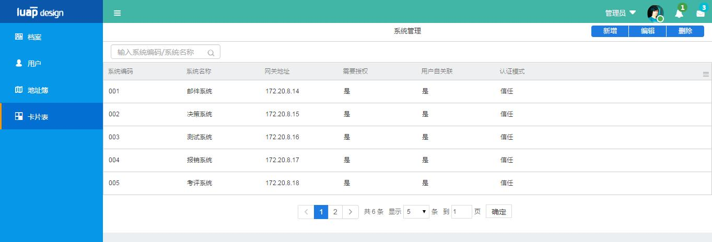

# 使用向导
[TOC]

## 元数据建模

## 根据元数据模型生成实体类和MVC相关文件
本部分主要介绍基于元数据metadata对数据库进行操作时，需要生成的实体类、dao、service、controller以及相关配置项的配置方法。

### pom依赖配置

依赖引入，在工程的pom文件中加入下面的配置

	<dependency>
	  <groupId>com.yonyou.iuap</groupId>
	  <artifactId>iuap-mdjdbc</artifactId>
	  <version>3.1.0-RELEASE</version>
	</dependency>

#### src/main/resources/applicationContext-metadata.xml 配置
	<?xml version="1.0" encoding="UTF-8"?>
	<beans xmlns="http://www.springframework.org/schema/beans"
		xmlns:xsi="http://www.w3.org/2001/XMLSchema-instance" xmlns:context="http://www.springframework.org/schema/context"
		xmlns:jdbc="http://www.springframework.org/schema/jdbc" xmlns:aop="http://www.springframework.org/schema/aop"
		xmlns:jee="http://www.springframework.org/schema/jee" xmlns:tx="http://www.springframework.org/schema/tx"
		xmlns:jpa="http://www.springframework.org/schema/data/jpa"
		xsi:schemaLocation="
			http://www.springframework.org/schema/beans http://www.springframework.org/schema/beans/spring-beans-4.0.xsd
			http://www.springframework.org/schema/context http://www.springframework.org/schema/context/spring-context-4.0.xsd
			http://www.springframework.org/schema/jdbc http://www.springframework.org/schema/jdbc/spring-jdbc-4.0.xsd
			http://www.springframework.org/schema/jee http://www.springframework.org/schema/jee/spring-jee-4.0.xsd
			http://www.springframework.org/schema/tx http://www.springframework.org/schema/tx/spring-tx-4.0.xsd
			http://www.springframework.org/schema/data/jpa http://www.springframework.org/schema/data/jpa/spring-jpa-1.3.xsd
			http://www.springframework.org/schema/aop http://www.springframework.org/schema/aop/spring-aop-4.0.xsd"
		default-lazy-init="true">
	
		<description>medatata_persistence</description>

		<!-- 元数据缓存配置相关，MetadataDAO操作元数据相关类的通用dao -->
		<bean id="mdBaseDAO" class="com.yonyou.iuap.persistence.bs.dao.MetadataDAO">
			<property name="jdbcTemplate" ref="crossdbJdbcTemplate" />
			<property name="dbMetaHelper" ref="mdDbMetaInfo" />
			<property name="saasCacheManager" ref="saasCacheManager" />
			<property name="dataChangeNotifier" ref="dataChangeNotifier" />
		</bean>
		
		<!-- 元数据缓存配置相关，获取相关类元数据信息的工具类 -->
		<bean id="mdDbMetaInfo"
			class="com.yonyou.iuap.persistence.bs.util.MetadataDBMetaHelper">
			<property name="jdbcTemplate" ref="crossdbJdbcTemplate" />
			<!--<property name="dbType" value="#{T(uap.web.persist.jdbc.framework.util.DBConsts).POSTGRESQL}"/> -->
		</bean>
	
		<bean id="dataChangeNotifier"
			class="com.yonyou.iuap.persistence.bs.notifier.DataChangeNotifier">
		</bean>
	
		<!-- 元数据缓存配置相关，支持单独配置saasCacheMgr或cacheManager -->
		<bean id="metadataCache" class="com.yonyou.metadata.mybatis.util.MetadataCache">
			<property name="saasCacheMgr">
				<bean id="saasCacheManager" class="com.yonyou.iuap.cache.SaasCacheManager">
					<property name="cacheManager" ref="cacheManager" />
				</bean>
			</property>
			<property name="cacheManager" ref="cacheManager" />
		</bean>
	
		<bean id="saasCacheManager" class="com.yonyou.iuap.cache.SaasCacheManager">
			<property name="cacheManager">
				<bean class="com.yonyou.iuap.cache.CacheManager">
					<property name="jedisTemplate" ref="jedisTemplate" />
					<property name="serializer">
						<bean
							class="com.yonyou.iuap.persistence.bs.cache.serializer.MetaFastJsonSerializer">
							<property name="metadataDBMetaHelper" ref="mdDbMetaInfo" />
						</bean>
					</property>
				</bean>
			</property>
		</bean>
	</beans>

### 示例完整结构
实例中的元数据应用，分为两个部分，1、数据库实体类，2、实体类对应的dao类

####数据库实体类
需要注意的是，@Entity、@Table、@Column、@Id、@GeneratedValue等注解都隶属于com.yonyou.iuap.persistence.jdbc.framework.annotation包，同时元数据的实体类要实现getMetaDefinedName、getNamespace两个方法。

	package com.yonyou.iuap.example.entity.meta;
	
	import com.yonyou.iuap.persistence.jdbc.framework.annotation.Column;
	import com.yonyou.iuap.persistence.jdbc.framework.annotation.Entity;
	import com.yonyou.iuap.persistence.jdbc.framework.annotation.GeneratedValue;
	import com.yonyou.iuap.persistence.jdbc.framework.annotation.Id;
	import com.yonyou.iuap.persistence.jdbc.framework.annotation.Stragegy;
	import com.yonyou.iuap.persistence.jdbc.framework.annotation.Table;
	import com.yonyou.iuap.persistence.vo.BaseEntity;
	
	import java.util.Date;
	
	
	/**
	 * <b> 此处简要描述此类功能 </b>
	 * 

	 * 此处添加类的描述信息
	 * 

	 * 创建日期:2016-12-13
	 * 
	 * @author
	 * @version
	 */
	@Entity(namespace = "metadata", name = "cardTableMeta")
	@Table(name = "cardTableMeta")
	public class CardTableMeta extends BaseEntity {
	
	    @Column(name = "name")
	    private java.lang.String name;
	
	    @Column(name = "code")
	    private java.lang.String code;
	
	    @Id
	    @GeneratedValue(strategy = Stragegy.UUID, moudle = "")
	    @Column(name = "pk_system")
	    private java.lang.String pksystem;
	
	    @Column(name = "gateway")
	    private java.lang.String gateway;
	
	    @Column(name = "radiodatacontroller")
	    private java.lang.String radiodatacontroller;
	
	    @Column(name = "radiodataassociate")
	    private java.lang.String radiodataassociate;
	
	    @Column(name = "combodatamodel")
	    private java.lang.String combodatamodel;
	
	    @Column(name = "tag")
	    private java.lang.String tag;
	
	    @Column(name = "createtime")
	    private java.util.Date createtime;
	
	    @Column(name = "dr")
	    private java.lang.Integer dr = 0;
	
	    @Column(name = "ts")
	    private java.util.Date ts;
	
	    public String getName() {
	        return name;
	    }
	
	    public void setName(String name) {
	        this.name = name;
	    }
	
	    public String getCode() {
	        return code;
	    }
	
	    public void setCode(String code) {
	        this.code = code;
	    }
	
	    public String getPksystem() {
	        return pksystem;
	    }
	
	    public void setPksystem(String pksystem) {
	        this.pksystem = pksystem;
	    }
	
	    public String getGateway() {
	        return gateway;
	    }
	
	    public void setGateway(String gateway) {
	        this.gateway = gateway;
	    }
	
	    public String getRadiodatacontroller() {
	        return radiodatacontroller;
	    }
	
	    public void setRadiodatacontroller(String radiodatacontroller) {
	        this.radiodatacontroller = radiodatacontroller;
	    }
	
	    public String getRadiodataassociate() {
	        return radiodataassociate;
	    }
	
	    public void setRadiodataassociate(String radiodataassociate) {
	        this.radiodataassociate = radiodataassociate;
	    }
	
	    public String getCombodatamodel() {
	        return combodatamodel;
	    }
	
	    public void setCombodatamodel(String combodatamodel) {
	        this.combodatamodel = combodatamodel;
	    }
	
	    public String getTag() {
	        return tag;
	    }
	
	    public void setTag(String tag) {
	        this.tag = tag;
	    }
	
	    public Date getCreatetime() {
	        return createtime;
	    }
	
	    public void setCreatetime(Date createtime) {
	        this.createtime = createtime;
	    }
	
	    public Integer getDr() {
	        return dr;
	    }
	
	    public void setDr(Integer dr) {
	        this.dr = dr;
	    }
	
	    public Date getTs() {
	        return ts;
	    }
	
	    public void setTs(Date ts) {
	        this.ts = ts;
	    }
	
	    @Override
	    public String getMetaDefinedName() {
	        return "cardTableMeta";
	    }
	
	    @Override
	    public String getNamespace() {
	        return "metadata";
	    }
	}

####实体类对应的dao类
实体类对应的dao类通过通用MetadataDAO对数据库进行操作。因此要对该dao进行autowire。方法如下
		
		@Qualifier("mdBaseDAO")
		@Autowired
		private MetadataDAO metadataDAO;

完整dao代码

	package com.yonyou.iuap.example.repository.meta;
	
	import java.util.List;
	import java.util.Map;
	import java.util.Map.Entry;
	
	import org.springframework.beans.factory.annotation.Autowired;
	import org.springframework.beans.factory.annotation.Qualifier;
	import org.springframework.data.domain.Page;
	import org.springframework.data.domain.PageRequest;
	import org.springframework.stereotype.Repository;
	
	import com.yonyou.iuap.example.entity.meta.CardTableMeta;
	import com.yonyou.iuap.persistence.bs.dao.DAOException;
	import com.yonyou.iuap.persistence.bs.dao.MetadataDAO;
	import com.yonyou.iuap.persistence.jdbc.framework.SQLParameter;
	
	/**
	 * 
Title: CardTableMetaDao

	 * 
Description: 

	 * @author zhukai
	 */
	@Repository
	public class CardTableMetaDao {
		
		@Qualifier("mdBaseDAO")
		@Autowired
		private MetadataDAO metadataDAO;
		
		/**
		 * 根据某一非主键字段查询实体
		 */
	    public List<CardTableMeta> findByCode(String code) {
	        String sql = "select * from cardTableMeta where code=?";
	        SQLParameter sqlparam = new SQLParameter();
	        sqlparam.addParam(code);
	        List<CardTableMeta> list = metadataDAO.queryByClause(CardTableMeta.class, sql, sqlparam);
	        return list;
	    }
	    
		/**
		 *分页相关
		 */
	    public Page<CardTableMeta> selectAllByPage(PageRequest pageRequest, Map<String, Object> searchParams) {
	        StringBuilder sql = new StringBuilder("select * from cardTableMeta");
	        SQLParameter sqlparam = new SQLParameter();
	        if (null != searchParams && !searchParams.isEmpty()) {
	            sql.append(" where ");
	            for (Entry<String, Object> key : searchParams.entrySet()) {
	                if (key.getKey().equalsIgnoreCase("searchParam")) {
	                    sql.append("(code like ? OR name like ?) AND ");
	                    for (int i = 0; i < 2; i++) {
	                        sqlparam.addParam("%" + key.getValue() + "%");
	                    }
	                }
	            }
	            sql.delete(sql.length() - 4, sql.length());
	        }
	        return metadataDAO.queryPage(sql.toString(), sqlparam, pageRequest, CardTableMeta.class);
	    }
	    
		/**
		 *批量操作
		 */
	    public void batchInsert(List<CardTableMeta> addList) throws DAOException {
	        metadataDAO.insert(addList);
	    }
	
	    public void batchUpdate(List<CardTableMeta> updateList) {
	        metadataDAO.update(updateList);
	    }
	
	    public void batchDelete(List<CardTableMeta> list) {
	        metadataDAO.remove(list);
	    }
	    
	
	
	}

## Service层编写规则以及事务处理

以样例中的 档案功能为例说明

### 包扫描规则的配置
   在 applicationContext.xml 配置文件中加入包路径扫描
   
         <!-- 使用annotation 自动注册bean, 并保证@Required、@Autowired的属性被注入 -->
	<context:component-scan base-package="com.yonyou.iuap,uap.iweb,com.yonyou.metadata.mybatis.service,com.yonyou.metadata.caches.redis">
		<context:exclude-filter type="annotation" expression="org.springframework.stereotype.Controller"/>
		<context:exclude-filter type="annotation" expression="org.springframework.web.bind.annotation.ControllerAdvice"/>
	</context:component-scan>

多个包名，用英文逗号隔开（,） 。

### 事务注解使用说明（简略）
java代码的service层，java目录结构类似 ： com.yonyou.iuap.example.service ,
对保存、修改、删除操作进行事务控制，用spring事务注解来实现。
service通过 @Autowired注解引入 dao层

    import org.springframework.transaction.annotation.Transactional;
    
    @Autowired
    CardTableMetaDao cardTableMetaDao;
   
   	/**
	 *批量删除
	 */
 	@Transactional
    public void batchDeleteByPrimaryKey(List<CardTableMeta> list) {
    	cardTableMetaDao.batchDelete(list);
    }

### 业务校验规则
业务中需要进行校验的，如编码不能重复。对校验不通过的直接抛出校验异常。
代码如（参见示例中 com.yonyou.iuap.example.validator.CardTableMetaValidator.java）

        public void valid(List<CardTableMeta> cardTableMetaList) {
        if (CollectionUtils.isEmpty(cardTableMetaList)) {
            throw new ValidException("提交的数据集为空!");
        }
        StringBuilder builder = new StringBuilder();
        for (CardTableMeta cardTableMeta : cardTableMetaList) {
            if (StringUtils.isEmpty(cardTableMeta.getPksystem())) {
                if (!cardTableMetaService.findByCode(cardTableMeta.getCode()).isEmpty()) {
                    builder.append(cardTableMeta.getCode()).append(",");
                }
            }
        }
        if (builder.toString().length() > 0) {
            String codeStr = builder.deleteCharAt(builder.length() - 1).toString();
            StringBuilder msgBuilder = new StringBuilder("编码为");
            msgBuilder.append(codeStr).append("的记录已经存在!");
            throw new ValidException(msgBuilder.toString());
        }
    }

service常用方法:

- public Page<SysDictType> selectAllByPage(PageRequest pageRequest, Map<String, Object> searchParams)；

- public void save(List<SysDictType> addList, List<SysDictType> updateList, List<SysDictType> removeList)

- public void batchDeleteByPrimaryKey(List<SysDictType> list) ；

- public SysDictType findByCode(String dictTypeCode) ；

方法名|说明| 参数 | 返回值
---|---|---|---
selectAllByPage | 根据条件进行分页查询|参数1：PageRequest，分页信息，参数2：Map<String, Object> 查询参数        map的key值为对应的bean的属性值，value为查询的值|Page<T>
save | 保存数据 |参数1：新添加数据集合，参数2：更新数据集合，参数3：删除数据集合|
batchDeleteByPrimaryKey|批量删除|参数1：要删除数据集合|
findByCode|根据编码查询，可用于校验编码重复问题|参数1：编码值 |

### 异常处理(throw Exception类型说明)
对异常进行统一处理， 在spring-mvc.xml配置异常处理类

    <bean class="com.yonyou.iuap.mvc.exceptionhandle.CustomExceptionResolver"/>

配置完成后，在编码过程中就可以直接将异常抛出，前端就可以显示抛出的异常信息，进行提示。
写法可见上面所抛出的 代码校验异常。

      throw new ValidException('编码已经存在');
      

校验异常中分为全局异常，和 局部异常，全局异常在页面上统一进行提示， 局部异常可以针对 每一个字段进行提示。
如果程序中不需要对每一个字段进行提示，则抛出全局异常即可。（示例中抛出的为全局异常）
      
还可以抛出 其他运行时异常 如：

      /**
       * 批量删除
      * @param list
      */
     @Transactional
    public void batchDeleteByPrimaryKey(List<CardTableMeta> list) {
        if (CollectionUtils.isEmpty(list)) {
            throw new WebRuntimeException("当前没有选中数据!");
        }
        cardTableMetaDao.batchDelete(list);
    }

### http请求处理以及参数转换
iuap针对通用的分页参数和查询参数做了类型转换，对分页参数转换为`Pagerequest`，查询参数转换为`SearchParams`。

#### spring 配置
需要在`spring-mvc.xml`中添加参数转换类`com.yonyou.iuap.mvc.RequestArgumentResolver`。
	
	<mvc:annotation-driven>
        <mvc:message-converters register-defaults="true">
            <!-- 将StringHttpMessageConverter的默认编码设为UTF-8 -->
            <bean class="org.springframework.http.converter.StringHttpMessageConverter">
                <constructor-arg value="UTF-8"/>
            </bean>
            <!-- 将Jackson2HttpMessageConverter的默认格式化输出设为true -->
            <bean class="org.springframework.http.converter.json.MappingJackson2HttpMessageConverter">
                <property name="prettyPrint" value="false"/>
            </bean>
        </mvc:message-converters>
        <mvc:argument-resolvers>
            <bean class="com.yonyou.iuap.mvc.RequestArgumentResolver"/>
        </mvc:argument-resolvers>
    </mvc:annotation-driven>

#### 使用说明
- 请求url

	http://localhost:8080/iuap-quickstart/sysUser/list?pageIndex=0&pageSize=5&sortField=create_time&sortDirection=desc&search_name=test&search_code=0x0004

- Controller的方法

	public JsonResponse list(PageRequest pageRequest, @FrontModelExchange(modelType = CardTable.class) SearchParams searchParams)

- 转换参数说明
<table>
	<tr><th>参数名</th><th>说明</th></tr>
	<tr><td>pageIndex</td><td>当前页数</td></tr>
	<tr><td>pageSize</td><td>每页显示的数据条数</td></tr>
	<tr><td>sortField</td><td>排序的列名称</td></tr>
	<tr><td>sortDirection</td><td>排序规则(asc|desc)</td></tr>
	<tr><td>search_*</td><td>查询条件，以search开头，后面是实体类的属性名</td></tr>
</table>

- 注解`@FrontModelExchange`

  如果不加`@FrontModelExchange`，`SearchParams`中所有的参数都是`String`类型；添加注解之后，参数会转换为实体Bean中的参数类型。

#### 注意事项

-  必须是`Get`请求

### http响应数据结构
统一使用`JsonReponse`作为`Controller`返回的数据结构,规范数据模型。
具体参考`BaseController`中的`buildSuccess()`和`buildError()`。

### 异常处理
#### spring-mvc中配置统一异常处理的handler

    <bean class="com.yonyou.iuap.mvc.exceptionhandle.CustomExceptionResolver"/>
#### 异常返回的数据结构
统一使用`JsonErrorReponse`作为返回的数据结构。

#### 异常处理方式

对于ajax请求或者http header中包含Accept:application/json 的请求，会返回json数据；
对于其他请求，会跳转到springmvc视图下的error/500页面。

### 完整的Controller配置及代码

- Controller代码
			
		package com.yonyou.iuap.example.web;
		
		import java.util.List;
		
		import org.springframework.beans.factory.annotation.Autowired;
		import org.springframework.data.domain.Page;
		import org.springframework.data.domain.PageRequest;
		import org.springframework.web.bind.annotation.RequestBody;
		import org.springframework.web.bind.annotation.RequestMapping;
		import org.springframework.web.bind.annotation.RequestMethod;
		import org.springframework.web.bind.annotation.ResponseBody;
		import org.springframework.web.bind.annotation.RestController;
		
		import com.yonyou.iuap.example.entity.meta.CardTableMeta;
		import com.yonyou.iuap.example.service.CardTableMetaService;
		import com.yonyou.iuap.example.validator.CardTableMetaValidator;
		import com.yonyou.iuap.mvc.type.SearchParams;
		
		/**
		 * 
Title: CardTableMetaController

		 * 
Description: 

		 * @author zhukai
		 */
		@RestController
		@RequestMapping(value = "/cardtablemeta")
		public class CardTableMetaController extends BaseController{
		    
			@Autowired
		    private CardTableMetaService cardTableMetaService;
			
			@Autowired
			private CardTableMetaValidator validtor;
		    
		
		    /**
		     * 查询分页数据
		     * 
		     * @param pageRequest
		     * @param searchParams
		     * @return
		     */
		    @RequestMapping(value = "/list", method = RequestMethod.GET)
		    public @ResponseBody Object page(PageRequest pageRequest, SearchParams searchParams) {
		        Page<CardTableMeta> data = cardTableMetaService.selectAllByPage(pageRequest, searchParams);
		        return buildSuccess(data);
		    }
		
		    /**
		     * 保存数据
		     * 
		     * @param list
		     * @return
		     */
		    @RequestMapping(value = "/save", method = RequestMethod.POST)
		    public @ResponseBody Object save(@RequestBody List<CardTableMeta> list) {
		        validtor.valid(list);
		        cardTableMetaService.save(list);
		        return buildSuccess();
		    }
		
		    /**
		     * 删除数据
		     * 
		     * @param list
		     * @return
		     */
		    @RequestMapping(value = "/del", method = RequestMethod.POST)
		    public @ResponseBody Object del(@RequestBody List<CardTableMeta> list) {
		    	cardTableMetaService.batchDeleteByPrimaryKey(list);
		        return buildSuccess();
		    }
		}

- spring-mvc配置
	
		<!-- 自动扫描且只扫描@Controller -->
	    <context:component-scan base-package="com.yonyou.iuap" use-default-filters="false">
	        <context:include-filter type="annotation" expression="org.springframework.stereotype.Controller"/>
	        <context:include-filter type="annotation"
	                                		expression="org.springframework.web.bind.annotation.ControllerAdvice"/>
	    </context:component-scan>
	
	    <mvc:annotation-driven>
	        <mvc:message-converters register-defaults="true">
	            <!-- 将StringHttpMessageConverter的默认编码设为UTF-8 -->
	            <bean class="org.springframework.http.converter.StringHttpMessageConverter">
	                <constructor-arg value="UTF-8"/>
	            </bean>
	            <!-- 将Jackson2HttpMessageConverter的默认格式化输出设为true -->
	            <bean class="org.springframework.http.converter.json.MappingJackson2HttpMessageConverter">
	                <property name="prettyPrint" value="false"/>
	            </bean>
	        </mvc:message-converters>
	        <mvc:argument-resolvers>
	            <bean class="com.yonyou.iuap.mvc.RequestArgumentResolver"/>
	        </mvc:argument-resolvers>
	    </mvc:annotation-driven>
	
	    <!-- freemarker的配置 -->
	    <bean id="freemarkerConfigurer"
	          class="org.springframework.web.servlet.view.freemarker.FreeMarkerConfigurer">
	        <property name="templateLoaderPath" value="/WEB-INF/views/"/>
	        <property name="defaultEncoding" value="UTF-8"/>
	        <property name="freemarkerSettings">
	            <props>
	                <prop key="template_update_delay">10</prop>
	                <prop key="locale">zh_CN</prop>
	                <prop key="datetime_format">yyyy-MM-dd HH:mm:ss</prop>
	                <prop key="date_format">yyyy-MM-dd</prop>
	            </props>
	        </property>
	        <property name="freemarkerVariables">
	            <map>
	                <entry key="ctx" value="/iuap-quickstart"/>
	            </map>
	        </property>
	    </bean>
	
	    <!-- FreeMarker视图解析器 -->
	    <bean id="viewResolver"
	         class="org.springframework.web.servlet.view.freemarker.FreeMarkerViewResolver">
	        <property name="viewClass" value="org.springframework.web.servlet.view.freemarker.FreeMarkerView"/>
	        <property name="suffix" value=".ftl"/>
	        <property name="contentType" value="text/html;charset=UTF-8"/>
	        <property name="exposeRequestAttributes" value="true"/>
	        <property name="exposeSessionAttributes" value="true"/>
	        <property name="exposeSpringMacroHelpers" value="true"/>
	        <property name="requestContextAttribute" value="request"/>
	    </bean>
	
	    <!-- 定义JSP文件的位置 -->
	    <bean class="org.springframework.web.servlet.view.InternalResourceViewResolver">
	        <property name="prefix" value="/WEB-INF/views/"/>
	        <property name="suffix" value=".jsp"/>
	    </bean>
	
	    <!-- 容器默认的DefaultServletHandler处理 所有静态内容与无RequestMapping处理的URL-->
	    <mvc:default-servlet-handler/>
	
	    <bean class="com.yonyou.iuap.mvc.exceptionhandle.CustomExceptionResolver"/>
	

##前端js以及html编写规则
### js
#### 前端js模型定义（meta.js）

	var metaCardTable={
					meta: {
						"name":{
							type:'string',
							required:true,
							notipFlag: true,
							hasSuccess: true,
							nullMsg:'系统名称不能为空!'
						},
						"code":{
							type:'string',
							required:true,
							notipFlag: true,
							hasSuccess: true,
							nullMsg:'系统编码不能为空!'
						},
						"radiodatacontroller":"",
						"radiodataassociate":"",
						"combodatamodel":"",
						"gateway": "",
						"pksystem":"",
						"ts":"",
						"tag": ""
					}
				};

前端js数据模型定义格式：

	var 数据模型名称={
					meta: {
						//数据模型对应的实体类字段
					}
				};

数据模型中的字段如果与后台实体类字段不一致，需要在类类名上加@JsonIgnoreProperties(ignoreUnknown = true)注解。

如果有数据模型有校验需求，可以参照如下配置：

		            worktel: {
		                type: 'string',
		                regExp: /^1[34578]\d{9}$/,
				        notipFlag: true,
				        hasSuccess: true,
				        errorMsg: "手机号码格式不对。"	
		            },	

regExp 为校验的匹配的正则表达式，errorMsg为校验不成功的错误信息。

#### 前端事件定义

前端事件都定义在了cardtable.js的viewModel.event中，其中包括了对前端增删改查按钮的响应、对各种ajax请求的发送和处理等。

				event: {					
	                //清除datatable数据
	                clearDt: function (dt) {
	                	dt.removeAllRows();
	                	dt.clear();
	                },
					// 卡片表数据读取
					initCardTableList:function(){
						var jsonData={
								pageIndex:viewModel.draw-1,
								pageSize:viewModel.pageSize,
								sortField:"createtime",
								sortDirection:"asc"
						};
						$(element).find("#search").each(function(){
							if(this.value == undefined || this.value =='' || this.value.length ==0 ){
								//不执行操作
							}else{
								jsonData['search_searchParam'] =  this.value.replace(/(^\s*)|(\s*$)/g, "");  //去掉空格
							}
						});
						$.ajax({
							type:'get',
							url:listUrl,
							datatype:'json',
							data:jsonData,
							contentType: 'application/json;charset=utf-8',
							success:function(res){
								if(res){
									if( res.success =='success'){
										if(res.detailMsg.data){
											viewModel.totleCount=res.detailMsg.data.totalElements;
											viewModel.totlePage=res.detailMsg.data.totalPages;
											viewModel.event.comps.update({totalPages:viewModel.totlePage,pageSize:viewModel.pageSize,currentPage:viewModel.draw,totalCount:viewModel.totleCount});
											viewModel.dt1.removeAllRows();
											viewModel.dt1.clear();
											viewModel.dt1.setSimpleData(res.detailMsg.data.content,{unSelect:true});
										}
									}else{
										var msg = "";
										if(res.success == 'fail_global'){
											msg = res.message;
										}else{
											for (var key in res.detailMsg) {
												msg += res.detailMsg[key] + " ";
											}
										}
										u.messageDialog({msg:msg,title:'请求错误',btnText:'确定'});
									}
								}else{
									u.messageDialog({msg:'后台返回数据格式有误，请联系管理员',title:'数据错误',btnText:'确定'});
								}
							},
							error:function(er){
								u.messageDialog({msg:'请求超时',title:'请求错误',btnText:'确定'});
							}
						});
					},
					//组装list
					genDataList:function(data){
						var datalist = [];
						datalist.push(data);
						return datalist ;
					},
					//删除方法
					deleteData: function(data) {
						var datalist = viewModel.event.genDataList(data);
						var json = JSON.stringify(datalist);
						$.ajax({
							url: delUrl,
							data: json,
							dataType: 'json',
							type: 'post',
							contentType: 'application/json',
							success: function (res) {
								//md.close();
								if(res){
									if (res.success == 'success') {
										u.messageDialog({msg:'删除成功',title:'操作提示',btnText:'确定'});
									} else {
										var msg = "";
										for(var key in res.message){
											msg +=res.message[key]+" ";
										}
										u.messageDialog({msg:'msg',title:'操作提示',btnText:'确定'});
									}
								}else{
									u.messageDialog({msg:'无返回数据',title:'操作提示',btnText:'确定'});
								}
								
							},
							error:function(er){
								u.messageDialog({msg:'操作请求失败，'+er,title:'操作提示',btnText:'确定'});
							}
						});
					},
					//新增和更新方法
					saveData:function(data) {
						var datalist = viewModel.event.genDataList(data);
						var json = JSON.stringify(datalist);
						$.ajax({
							url: saveUrl,
							type: 'post',
							data: json,
							dataType: 'json',
							contentType: 'application/json',
							success: function (res) {
								if(res){
									if( res.success =='success'){
			                            viewModel.event.initCardTableList();
										u.messageDialog({msg:'操作成功',title:'操作提示',btnText:'确定'});
										md.close();
									}else{
										var msg = "";
										if(res.success == 'fail_global'){
											msg = res.message;
										}else{
											for (var key in res.detailMsg) {
												msg += res.detailMsg[key] + " ";
											}
										}
										u.messageDialog({msg:msg,title:'操作提示',btnText:'确定'});
									}
								}else{
									u.messageDialog({msg:'没有返回数据',title:'操作提示',btnText:'确定'});
								}
							}
						});
					},
					//分页相关
					pageChange:function(){
						viewModel.event.comps.on('pageChange', function (pageIndex) {
							viewModel.draw = pageIndex + 1;
							viewModel.event.initCardTableList();
						});
					},
					sizeChange:function(){
						viewModel.event.comps.on('sizeChange', function (arg) {
							viewModel.pageSize = parseInt(arg);
							viewModel.draw = 1;
							viewModel.event.initCardTableList();
						});
					},
					//页面初始化
					pageInit: function () {		       
						$(element).html(html) ;
						viewModel.app = u.createApp({
							el: element,
							model: viewModel
						});
						
						var paginationDiv = $(element).find('#pagination')[0];
						this.comps=new u.pagination({el:paginationDiv,jumppage:true});
						this.initCardTableList();
						viewModel.event.pageChange();
						viewModel.event.sizeChange();
						
	                    //回车搜索
	                    $('.input_enter').keydown(function(e){
	                        if(e.keyCode==13){
	                            $('#searchBtn').trigger('click');

	                        }
	                    });
					},
					//页面按钮事件绑定
					/* 导航的三个按钮 编辑 添加 删除 */
					editClick:function(){
						$('#editPage').find('.u-msg-title').html("编辑");
						viewModel.event.clearDt(viewModel.dtnew);
						var row = viewModel.dt1.getSelectedRows()[0];
						if(row){
							viewModel.dtnew.setSimpleData(viewModel.dt1.getSimpleData({type: 'select'}));
							window.md = u.dialog({id: 'editDialog', content: '#editPage', hasCloseMenu: true});
						}else{
							u.messageDialog({msg:'请选择要编辑的数据！',title:'操作提示',btnText:'确定'});
						}
					},
					addClick:function(){
						$('#editPage').find('.u-msg-title').html("新增");
						viewModel.event.clearDt(viewModel.dtnew);
						var newr = viewModel.dtnew.createEmptyRow();
						newr.setValue("radiodatacontroller","Y");
						newr.setValue("radiodataassociate","Y");
						viewModel.dtnew.setRowSelect(newr);
						window.md = u.dialog({id: 'addDialog', content: '#editPage', hasCloseMenu: true});
						$('#addDialog').css('width', '70%');
					},
					delClick:function(){
						var row = viewModel.dt1.getSelectedRows()[0];
						if(row){
							var data = viewModel.dt1.getSelectedRows()[0].getSimpleData()
							u.confirmDialog({
					            msg: "是否删除"+data.name+"?",
					            title: "删除确认",
					            onOk: function () {
					                viewModel.event.deleteData(data);
					                viewModel.dt1.removeRow(viewModel.dt1.getSelectedIndexs());
					            },
					            onCancel: function () {
					            }
							});
						}else{
							u.messageDialog({msg:'请选择要删除的数据！',title:'操作提示',btnText:'确定'});
						}
					},
					searchClick:function(){
						viewModel.draw = 1; 
						viewModel.event.initCardTableList();
					},
					saveOkClick:function(){
						var data = viewModel.dtnew.getSimpleData()[viewModel.dtnew.getSelectedIndexs()];
	                    if (!viewModel.app.compsValidate($('#editPage')[0])) {
	                        return;
	                    }
						viewModel.event.saveData(data);
					},
					saveCancelClick:function(e){
							md.close();
					}
				}

#### 增删改查代码说明

增删改查的实现都分为三个步骤,1、实现对前台按钮的响应。2、实现前台按钮按下后的处理逻辑。3、调用相应的ajax请求。以卡片表为例，其中initCardTableList、deleteData、saveData为ajax请求发送方法。editClick、addClick、delClick、为对前台按钮按下的响应方法。searchClick、saveOkClick、saveCancelClick为响应菜单弹出后，各种不同处理方法、这些方法分别调用不同的ajax请求发送方法。

源码如下：

**ajax请求发送方法**
其中initCardTableList读取

					// 卡片表数据读取
					initCardTableList:function(){
						var jsonData={
								pageIndex:viewModel.draw-1,
								pageSize:viewModel.pageSize,
								sortField:"createtime",
								sortDirection:"asc"
						};
						$(element).find("#search").each(function(){
							if(this.value == undefined || this.value =='' || this.value.length ==0 ){
								//不执行操作
							}else{
								jsonData['search_searchParam'] =  this.value.replace(/(^\s*)|(\s*$)/g, "");  //去掉空格
							}
						});
						$.ajax({
							type:'get',
							url:listUrl,
							datatype:'json',
							data:jsonData,
							contentType: 'application/json;charset=utf-8',
							success:function(res){
								if(res){
									if( res.success =='success'){
										if(res.detailMsg.data){
											viewModel.totleCount=res.detailMsg.data.totalElements;
											viewModel.totlePage=res.detailMsg.data.totalPages;
											viewModel.event.comps.update({totalPages:viewModel.totlePage,pageSize:viewModel.pageSize,currentPage:viewModel.draw,totalCount:viewModel.totleCount});
											viewModel.dt1.removeAllRows();
											viewModel.dt1.clear();
											viewModel.dt1.setSimpleData(res.detailMsg.data.content,{unSelect:true});
										}
									}else{
										var msg = "";
										if(res.success == 'fail_global'){
											msg = res.message;
										}else{
											for (var key in res.detailMsg) {
												msg += res.detailMsg[key] + " ";
											}
										}
										u.messageDialog({msg:msg,title:'请求错误',btnText:'确定'});
									}
								}else{
									u.messageDialog({msg:'后台返回数据格式有误，请联系管理员',title:'数据错误',btnText:'确定'});
								}
							},
							error:function(er){
								u.messageDialog({msg:'请求超时',title:'请求错误',btnText:'确定'});
							}
						});
					},

deleteDatas删除方法

						//删除方法
						deleteData: function(data) {
							var datalist = viewModel.event.genDataList(data);
							var json = JSON.stringify(datalist);
							$.ajax({
								url: delUrl,
								data: json,
								dataType: 'json',
								type: 'post',
								contentType: 'application/json',
								success: function (res) {
									//md.close();
									if(res){
										if (res.success == 'success') {
											u.messageDialog({msg:'删除成功',title:'操作提示',btnText:'确定'});
										} else {
											var msg = "";
											for(var key in res.message){
												msg +=res.message[key]+" ";
											}
											u.messageDialog({msg:'msg',title:'操作提示',btnText:'确定'});
										}
									}else{
										u.messageDialog({msg:'无返回数据',title:'操作提示',btnText:'确定'});
									}
									
								},
								error:function(er){
									u.messageDialog({msg:'操作请求失败，'+er,title:'操作提示',btnText:'确定'});
								}
							});
						},

saveData新增和更新方法

					//新增和更新方法
					saveData:function(data) {
						var datalist = viewModel.event.genDataList(data);
						var json = JSON.stringify(datalist);
						$.ajax({
							url: saveUrl,
							type: 'post',
							data: json,
							dataType: 'json',
							contentType: 'application/json',
							success: function (res) {
								if(res){
									if( res.success =='success'){
			                            viewModel.event.initCardTableList();
										u.messageDialog({msg:'操作成功',title:'操作提示',btnText:'确定'});
										md.close();
									}else{
										var msg = "";
										if(res.success == 'fail_global'){
											msg = res.message;
										}else{
											for (var key in res.detailMsg) {
												msg += res.detailMsg[key] + " ";
											}
										}
										u.messageDialog({msg:msg,title:'操作提示',btnText:'确定'});
									}
								}else{
									u.messageDialog({msg:'没有返回数据',title:'操作提示',btnText:'确定'});
								}
							}
						});
					},

**前台按钮响应方法**

editClick编辑按钮响应

					editClick:function(){
						$('#editPage').find('.u-msg-title').html("编辑");
						viewModel.event.clearDt(viewModel.dtnew);
						var row = viewModel.dt1.getSelectedRows()[0];
						if(row){
							viewModel.dtnew.setSimpleData(viewModel.dt1.getSimpleData({type: 'select'}));
							window.md = u.dialog({id: 'editDialog', content: '#editPage', hasCloseMenu: true});
						}else{
							u.messageDialog({msg:'请选择要编辑的数据！',title:'操作提示',btnText:'确定'});
						}
					},

addClick添加按钮响应

					addClick:function(){
						$('#editPage').find('.u-msg-title').html("新增");
						viewModel.event.clearDt(viewModel.dtnew);
						var newr = viewModel.dtnew.createEmptyRow();
						newr.setValue("radiodatacontroller","Y");
						newr.setValue("radiodataassociate","Y");
						viewModel.dtnew.setRowSelect(newr);
						window.md = u.dialog({id: 'addDialog', content: '#editPage', hasCloseMenu: true});
						$('#addDialog').css('width', '70%');
					},

delClick删除按钮响应

					delClick:function(){
						var row = viewModel.dt1.getSelectedRows()[0];
						if(row){
							var data = viewModel.dt1.getSelectedRows()[0].getSimpleData()
							u.confirmDialog({
					            msg: "是否删除"+data.name+"?",
					            title: "删除确认",
					            onOk: function () {
					                viewModel.event.deleteData(data);
					                viewModel.dt1.removeRow(viewModel.dt1.getSelectedIndexs());
					            },
					            onCancel: function () {
					            }
							});
						}else{
							u.messageDialog({msg:'请选择要删除的数据！',title:'操作提示',btnText:'确定'});
						}
					},

**处理逻辑调用方法**

searchClick搜索逻辑

					searchClick:function(){
						viewModel.draw = 1; 
						viewModel.event.initCardTableList();
					},

saveOkClick保存逻辑

					saveOkClick:function(){
						var data = viewModel.dtnew.getSimpleData()[viewModel.dtnew.getSelectedIndexs()];
	                    if (!viewModel.app.compsValidate($('#editPage')[0])) {
	                        return;
	                    }
						viewModel.event.saveData(data);
					},

saveCancelClick保存取消按钮逻辑

					saveCancelClick:function(e){
							md.close();
					}

### html
增删改查片段说明

### 按钮事件的绑定

            

                <button class="u-button u-button-primary "
                        id="addButton" data-bind="click: event.addClick">新增
                </button>
                <button class="u-button u-button-primary "
                        id="editButton" data-bind="click: event.editClick">编辑
                </button>
                <button class="u-button u-button-primary" id="delButton" data-bind="click: event.delClick">删除</button>
            

### 列表显示的绑定

    <!--table-->
    

        

            

                

                

                

                

                

                

            

        

        

    

###编辑弹出框的绑定
		
		<!-编辑-->
		

		    
新增

		    

		        <!--第一行-->
		        

		            

		                <label for="code" class="u-input-label right">系统编码:</label>
		            

		            

		                
*
		                

		                <input type="text" id="code"
		                       class="u-form-control padding-left-15"
		                       u-meta='{"type":"string","data":"dtnew","field":"code"}'
		                       placeholder="系统编码不能为空">
		            

		            

		                <label class="u-input-label right">系统名称:</label>
		            

		            

		                
*
		                

		                <input type="text" id="name"
		                       class="u-form-control padding-left-15"
		                       u-meta='{"type":"string","data":"dtnew","field":"name"}'
		                       placeholder="系统名称不能为空">
		            

		        

		        <!--第二行-->
		        

		            

		                <label class="u-input-label right">网关地址:</label>
		            

		            

		                <input type="text" id="gateway" class="u-form-control"
		                       u-meta='{"id":"gateway","type":"string","data":"dtnew","field":"gateway"}'
		                       placeholder="网关地址">
		            

		            

		                <label class="u-input-label right">认证模式:</label>
		            

		            

		                <input class="u-input"/> 
		            

		        

		
		        <!--第三行-->
		        

		            

		                <label class="u-input-label right">需要授权: </label>
		            

		            

		                

		                    <label class="u-radio"> <input type="radio" class="u-radio-button" name="radiodatacontroller"> 
		                    </label>
		                

		            

		        

		
		        <!--第四行-->
		        

		            

		                <label class="u-input-label right">自行关联: </label>
		            

		            

		                

		                    <label class="u-radio"> <input type="radio"
		                                                   class="u-radio-button" name="radiodataassociate"> 
		                    </label>
		                

		            

		        

		    

		    

		        

		            <button type="button" class="u-button u-button-white editCancel margin-right-15 "
		                    id="editCancel" data-bind="click: event.saveCancelClick">取消
		            </button>
		            <button type="button"
		                    class="u-button raised u-button-primary margin-right-10" id="editOk"
		                    data-bind="click: event.saveOkClick">保存
		            </button>
		
		        

		    

		

## 菜单添加以及路由配置

index.html添加节点

            <li class='nav-li'>
                <a href="#cardtable/cardtable">
                    <i class="uf uf-4-s-o-2"></i>
                    卡片表
                </a>
            </li>

## 调试页面

页面截图

