#快速代码生成step by step
---
## 1. 开发工具配置

请参考iuap官网开发文档

[http://iuap.yonyou.com/page/service/book/platform3/index.html#/platform3/articles/iuap-develop/4-/kai\_fa\_gong\_ju\_pei\_zhi.html]()
## 2. 创建新工程

请参考iuap官网开发文档

[http://iuap.yonyou.com/page/service/book/platform3/index.html#/platform3/articles/iuap-develop/4-/chuang\_jian\_xin\_gong\_cheng.html]()
## 3. 元数据设计
想要制作一个经典的增删改查页面，iuap开发平台提供了两种开发方式，一个是元数据驱动开发，一个是mybatis方式从数据库生成页面。首先我们介绍元数据驱动开发方式，也是我们主要提倡的方式，我们提供了大量模版支持元数据开发。 mybatis方式我们会在后面简单介绍。

### 3.1 元数据设计器
元数据设计器作为实体模型、数据库模型的定义以及代码生成和脚本生成的工具，为业务系统中的领域模型的建立和基础代码的产生提供了一个完整的平台。业务分析和设计人员在建立领域模型时，其模型元素和模型设计器的实体操作等模型保持一致的描述方式，以保证领域模型顺利的建立和代码的顺利生成。

根据界面功能分布，元数据模型设计器有5个重要的组成部分，分别是元数据管理器、画布、工具面板、属性面板和模型视图

#### 3.1.1 元数据管理器
元数据管理器是提供元数据的相关管理工具，它支持元数据的创建、数据库导入实体组件、导入元数据bmf文件及删除元数据文件同时方便查看所有模型资源以及公共资源。 
管理器的文件系统结构是按树形方式展开，反映组件的树型组织关系：

#### 3.1.2 新建元数据
创建元数据bmf文件。

下面我们具体介绍几种元数据类型的设计步骤。

### 3.2 单表元数据设计
示例1: 档案管理

1. 档案管理示例为单表维护，即创建一个元数据实体即可。如下图

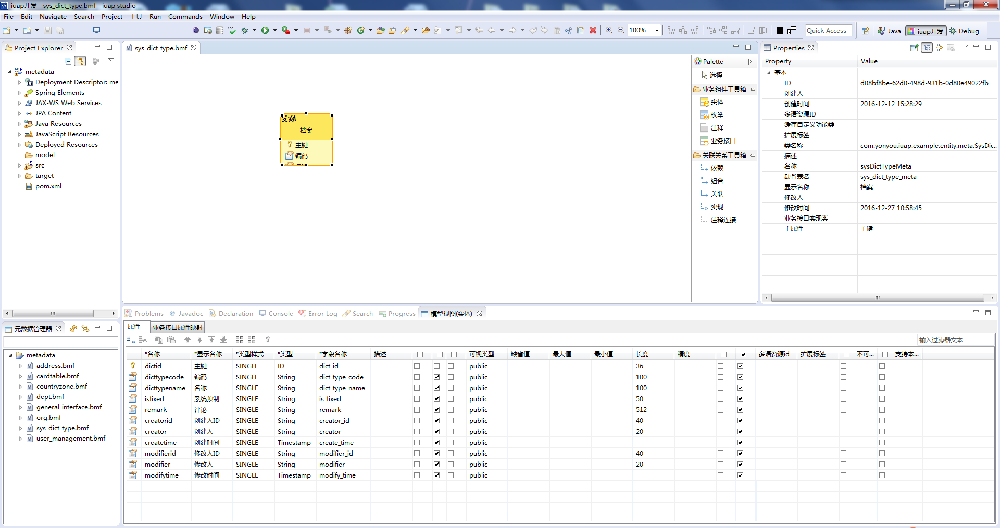

		部分属性、特性说明：
	
		1、主键：dictid，类型选择ID类型。
		2、其他略，请参照官网元数据工具使用说明实现其业务设计。

2. 发布元数据。（元数据实体上右键发布元数据）
3. 生成建库SQL脚本。（元数据实体上右键生成建库SQL脚本）生成在对应目录后，在其示例数据库中执行其脚本
4. 至此元数据设计阶段结束，后续使用元数据持久化等实现其页面展示及demo工程。
演示示例如下图

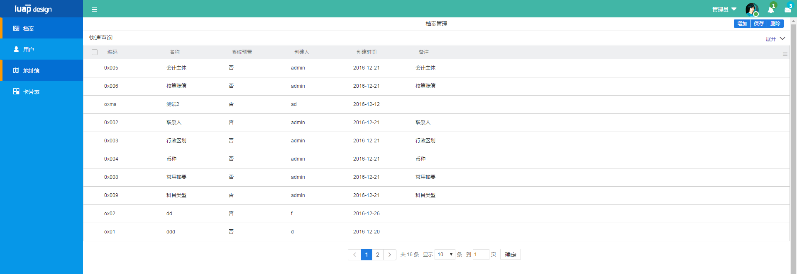
### 3.3 参照元数据
示例1: 组织参照

1. 组织参照描述了单位的组织结构信息，在这里我们设计一个单表来表示组织关系。如下图：

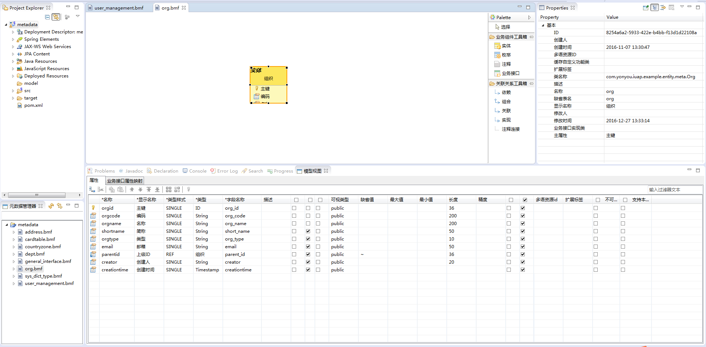

		部分属性、特性说明：
		
		使用自关联（自引用）即树形表现形式。（目前平台提供的前端控件暂时只支持树形参照）
		
		注：使用自关联时其上级ID属性必须为parentid
2. 发布元数据。（元数据实体上右键发布元数据）
3. 生成建库SQL脚本。（元数据实体上右键生成建库SQL脚本）生成在对应目录后，在其示例数据库中执行其脚本
4. 在数据库中新生成的参照表中写入数据。为了其他元数据使用参照时能够查询到数据。
 
### 3.4 普通主子表元数据设计
示例1: 用户管理

1. 用户管理示例为主子表关系，即创建组合元数据实体并增加参照。如下图

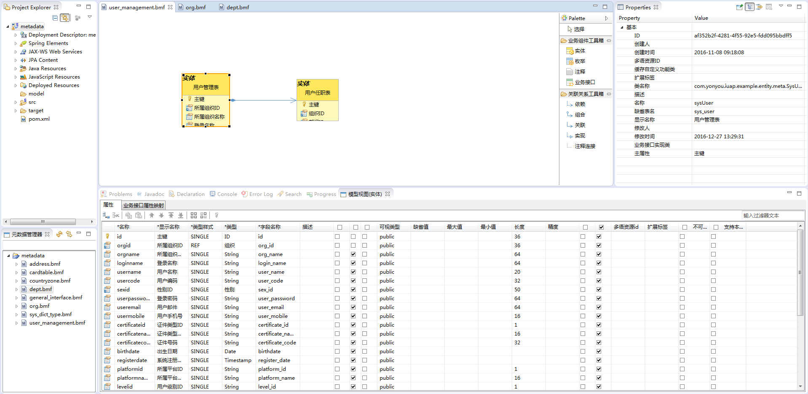

		部分属性、特性说明：
		1、用户管理实体中引用组织，即可在后续演示示例中用户管理下直接可呈现出所属组织的相关信息。
		2、用户任职实体中引用部门，即可在后续演示示例中用户任职下直接可呈现出所属部门的相关信息。
		3、用户管理表及用户任职表为主子表形式。
		4、其他略，请参照官网元数据工具使用说明实现其业务设计
2. 发布元数据，生成并执行建库sql脚本
3. 至此元数据设计阶段结束，后续使用元数据持久化等实现其页面展示及demo工程。演示示例如下图：

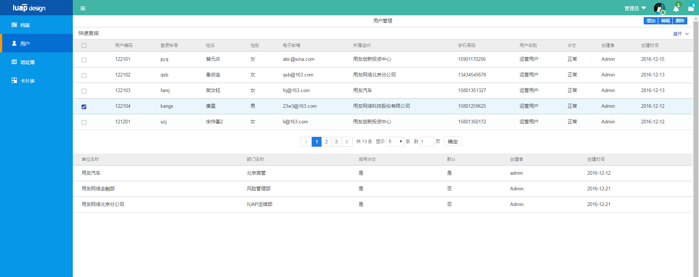

### 3.5 树表元数据（主子表）设计
示例1: 通讯录

1. 通讯录示例为主子表关系，即创建组合元数据实体并增加参照。如下图

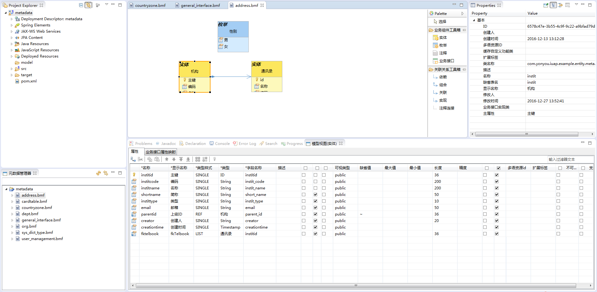

		部分属性、特性说明：
		1、机构元数据为自关联（自引用）树形结构。
		注：使用自关联时其上级ID属性必须为parentid。
		2、地址薄元数据中引用国家地区，在后续使用中即可在地址薄中直接显示出所属国家地区相关信息。
		3、创建一个枚举（性别），地址薄中类型选择枚举类型（性别），在后续中即可呈现出来。也就是男、女所对应的实际值。
		4、机构、地址薄为主子表形式。
		5、其他略，请参照官网元数据工具使用说明实现其业务设计。

2. 发布元数据，生成并执行建库sql脚本
3. 至此元数据设计阶段结束，后续使用元数据持久化等实现其页面展示及demo工程。演示示例如下图

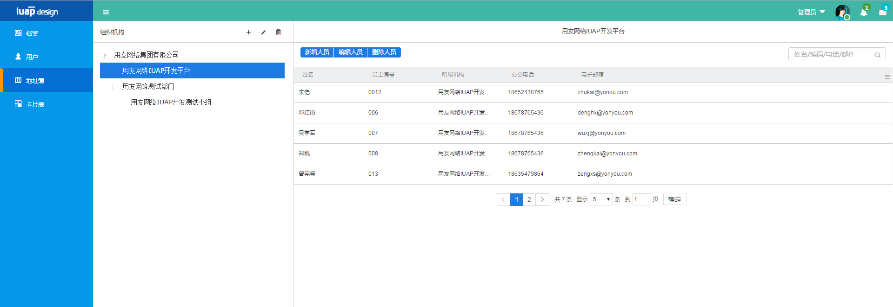

### 3.6 元数据创建注意事项
1.	对于组合关系，子实体中不需要指向主实体的外键属性，这是业务模型而不是数据库模型，在元数据发布时会自动在数据库中为子表加上外键。
2.	枚举类型必须设置返回值类型，当前支持String和Integer两种
3.	必须保存后才能发布
4.	发布时会一起发布被依赖的组件，支持双向依赖，循环依赖。
如果发布元数据时忽略版本，则完全以本地的模型文件为准，可能造成库中新版本的模型被覆盖，非特殊情况不推荐使用

使用快速代码生成时注意：  

1. 元数据实体中使用枚举时必须确保枚举和实体在同一元数据文件中。
2. 使用关联引用时必须确保引用元数据不在同一元数据文件中。

## 4. 快速代码生成向导
在studio中右键点击iuap工程， 选择iuap Tools->快速代码生成菜单项即可进入向导。完成向导即可完成模式化过程。
### 4.1 数据来源配置页
模式化过程首选选择数据来源：元数据和数据库两种。官方内置模版提供了6套模版，其中4套元数据模版和2套数据库模版。 因为数据库来源本身的限制，无法描述比较复杂的表之间的关系，所以内置模版只提供了单表的2套模版。如果选择元数据来源，可以使用单表和主子表模版两种共4套模版。 
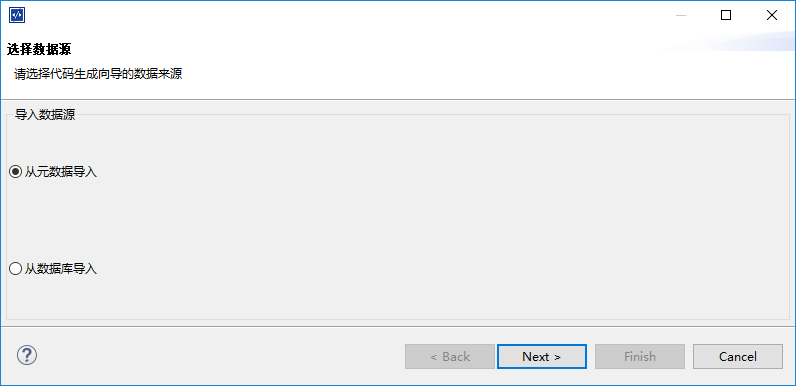
### 4.2 元数据选择页
在数据来源中选择元数据导入，点击下一步进入元数据选择页。 如下所示：

左侧为当前iuap工程的元数据列表。右侧为元数据属性选择列表。 点击左侧的元数据bmf文件名称， 右侧默认全选此bmf元数据文件描述的所有实体属性。若点击左侧的bmf文件的子实体，则右侧显示实体里的属性列表，由用户自主勾选所需属性。 

要注意的是： 

	1. 若元数据为主子表元数据并且用户想使用主子表模版进行生成，则左侧必须选择元数据bmf文件，勾选此主子表元数据的所有实体属性。
	2. 主键必须勾选。
	3. 单表元数据不支持自引用字段。不能勾选。
	
### 4.3 模版信息配置页
在属性选择页勾选需要的数据属性后，点击下一步，进入模版信息配置页，如下所示：

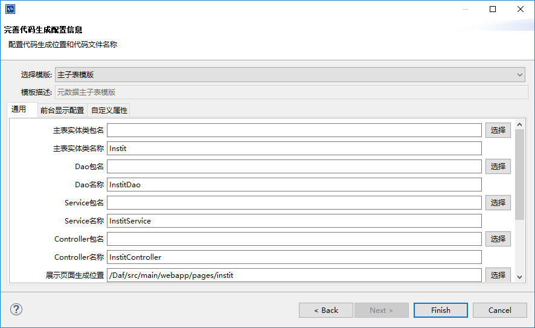
其中top区域为模版选择区，下面有三个页签页，分别为通用配置区，前台显示配置区和自定义属性配置区。

#### 4.3.1 模版选择
在模版下拉框中选择需要使用的模版。下拉框中的内容会跟随数据来源类型进行动态筛选。

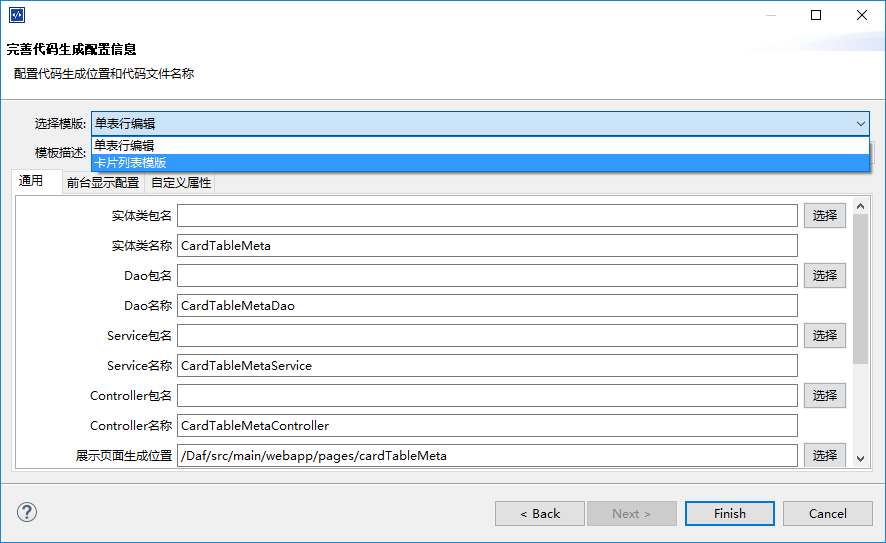

#### 4.3.2 模版通用配置
在这个区域中配置模版生成的文件的位置和名称。

#### 4.3.3 前台显示配置
点击前台显示配置页签， 进入前台控件配置页，如图所示：

页面中列表列出了上一步所勾选的所有属性。列表header字段有属性名,属性类型，显示名，是否显示，表单控件，控件属性，是否查询字段，主子表这几项。

其中属性名和属性类型不可更改。显示名为生成的前台页面的显示名称，可以更改。是否显示为此属性是否显示在前台列表或表单中。 一般主键和子表外键字段默认不显示。

表单控件项选择属性行在前台表单中对应的控件类型。 目前有字符串输入框，时间日期框，下拉框和参照框可选。String类型默认为字符串输入框。 元数据枚举项字段默认为下拉框，参照字段默认为参照框。控件属性项为表单控件的补充，根据绑定控件的不同，属性项填入的内容也不同。查询字段项为选择此属性行是否为前台的查询字段。 主子表项若为parent，则此属性行为主表属性，为空或child则为子表字段或单表字段。

要注意的是：

1. 表单绑定控件选择为下拉框，若此行属性为元数据的枚举字段，则后面的控件属性项不需要填写内容。 若此行为普通的String类型字段，则需要在控件属性项中添加下拉框的key，value值。 
2. 非元数据参照字段不能自行选择为参照框。元数据参照字段需要在控件属性项中配置参照元数据实体的显示字段（属性名）。例如参照为org组织参照，则需要在控件属性项中填写显示属性为orgname

#### 4.3.4 自定义属性配置
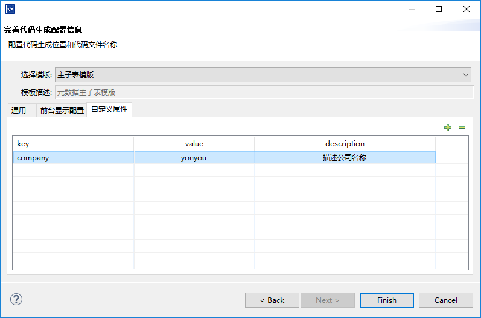
用户可在自定义属性页中，自定义键值对，在模版页内容中通过引擎提供的方法根据key值获取value。自定义属性使用方法在模式化引擎使用手册中会具体介绍。

## 5. mybatis方式简介
若数据来源采用从数据库导入，则模式化向导采用mybatis持久化方式生成代码。 这种方式的好处是不需要设计元数据文件， 直接解析数据库的表结构，生成需要的页面，持久化效率较高，缺点是数据库来源本身的限制，无法方便描述比较复杂的表之间的关系，所以目前只提供了单表模版供使用。
在快速代码生成向导中选择从数据库导入，进入数据表选择页面。如图：

左侧为当前工程关联数据库的数据表列表（数据库信息在数据库连接配置中设置)。右侧为数据表的字段选择列表，由用户自由勾选所需要的字段。

要注意的是：

	1. 主键必须勾选
	2. 若数据库字段类型显示为不支持，则需要点击后面的java 类列的空白处下拉选择字段对应的java类型。若不选择对应java类型，则默认不使用此字段。
	
其他步骤同元数据方式。完成向导后，稍作配置即可浏览效果。

## 6. 修改工程配置文件和index首页菜单
快速代码生成向导完成后，用户可以按需求修改工程applicationContext配置文件，选择使用redis或者扫描路径等。我们会在后面的代码详解中具体说明。 
如果想在首页菜单中显示所做功能页面，可以修改index.html， 在左侧菜单配置中新增一个菜单项即可。

	

        

            
	        	<i class="uf uf-iuapdesignz" style="color:#fff;font-size: 100px;"></i>
            
        

        <ul class="nav-menu height-full" id="menu">
            <li class='nav-li'>
                <a href="#dict/dicttype">
                    <i class="uf uf-role"></i>
                    档案
                </a>
            </li>
            <li class='nav-li'>
                <a href="#user/user">
                    <i class="uf uf-caven "></i>
                    用户
                </a>
            </li>
            <li class='nav-li'>
                <a href="#addressBook/contacts">
                    <i class="uf uf-map "></i>
                    地址簿
                </a>
            </li>
            <li class='nav-li'>
                <a href="#cardtable/cardtable">
                    <i class="uf uf-4-s-o-2"></i>
                    卡片表
                </a>
            </li>
            <li class='nav-li'>
                <a href="#xxx/xxx">
                    <i class="uf uf-4-s-o-2"></i>
                    新增菜单项
                </a>
            </li>
        </ul>
    

## 7. 页面预览及调试
修改完成index.html后，检查一下生成的代码有无编译错误， 若代码无误， 则启动中间件。

在这里我们提供了tomcat和jetty的方式启动中间件。   
用户可以通过右键点击项目，选择Run as -> Maven build,在弹出的对话框中输入：tomcat:run 或者jetty:run, 即可由maven自行下载相关jar包并启动服务。如图：

或者用户自行配置Server服务器，选择tomcat相应版本并启动。

启动完成后，在浏览器输入 http://localhost:8080/xxxxx(工程artifactid)即可浏览工程页面。如图所示：

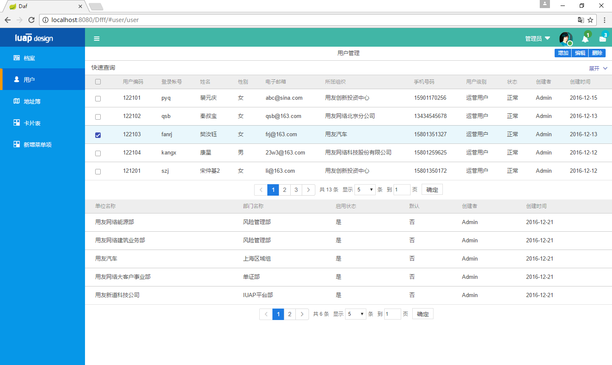

