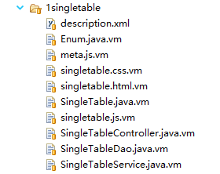
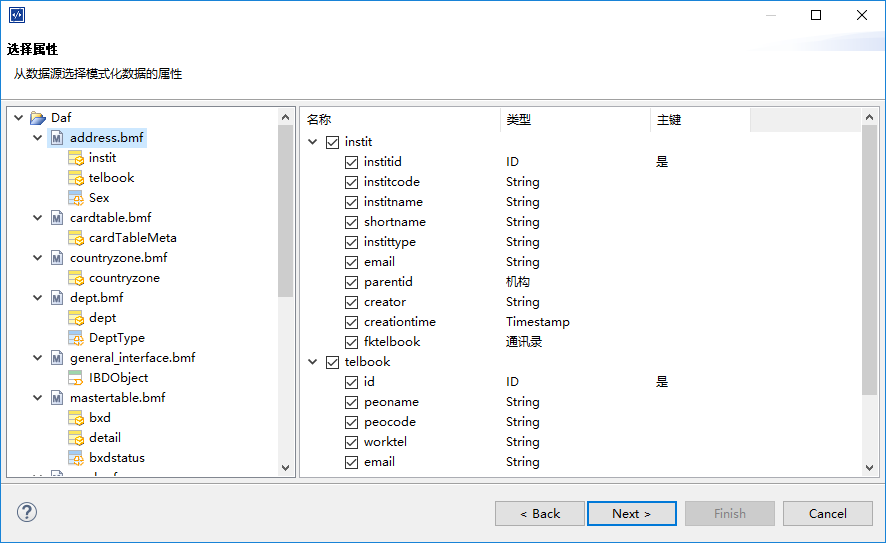
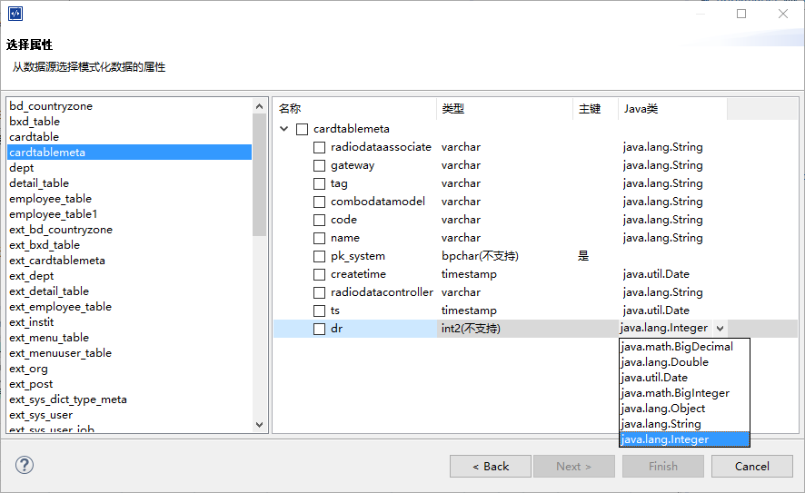
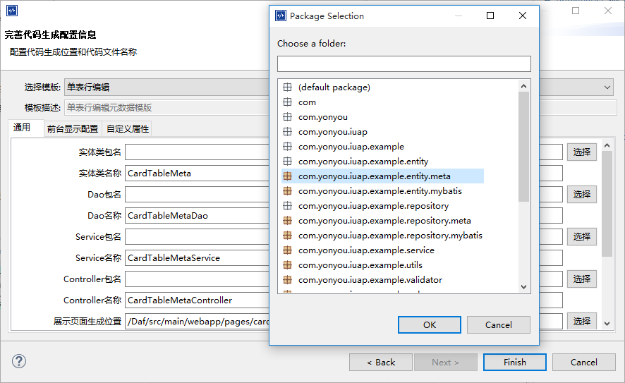
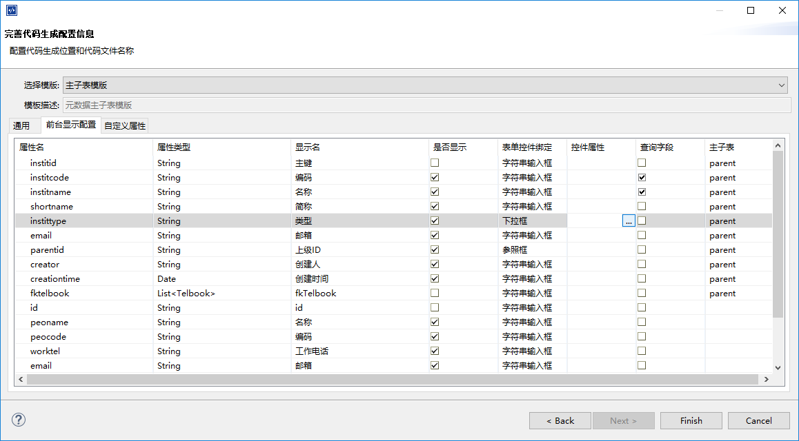

## iuap studio 代码模式化引擎使用说明
---
iuap studio 提供的快速代码模式化功能支持用户自定义模板和属性，支持元数据和关系型数据库两种数据来源。通过将来源数据归纳为内部对象，使用velocity模板语言，可将用户重用的场景代码制作为模版，通过studio的模式化功能快速生成代码。
### 1. 模板加载路径
studio通过读取特定路径的模板内容加载模板，将模板配置转化成可识别的用户界面，生成模式化向导供用户配置模版信息。模板的来源有两种：内置模板和用户自定义模板。
#### 1.1 内置模板
iuap studio官方版本会自带搭载iuap开发平台经典场景的数套模版，提供给用户开发或参考。

模版放在studio根目录的plugin下的`com.yonyou.studio.iuap.codeGenerator`包中。内置模板建议不要修改，可通过studio的在线更新功能随时获取官方发布的最新模板。
#### 1.2 用户自定义模版
除了使用官方内置模版外，用户可自定义代码模版。模版可放在用户studio根目录下的`templates/generator`路径下。例如在generator目录下新建userTemp目录，在新建目录中按照下文的模版配置规则创建`description.xml`文件，重新打开studio，即可加载用户自定义模板。

### 2. 模版配置文件
无论是内置模版还是用户自定义模版，在具体模版的目录下存在description.xml文件作为模版的描述，系统通过读取description.xml文件，将模版解析分类，生成配置向导，供用户配置模式化的基本信息。可以说description.xml配置文件是模版引擎的核心，整个功能通过解析此配置文件才能联通各个关节，达到最终的快速生成的效果。下面让我们来具体分析一下文件的内容。举例如下：

    <codeGenerator displayname="自定义模板" id="custom" type="metadata" ext="true" xmlns="http://www.yonyou.com/studio/codeGenerator/description" xmlns:xsi="http://www.w3.org/2001/XMLSchema-instance" xsi:schemaLocation="http://www.yonyou.com/studio/codeGenerator/description description.xsd ">
      <description>用户自定义经典场景一模版</description>
      <info>
      	模式化完成后请修改index.html中的导航路径，并点击预览。并修改applicationContext中的扫描路径以保证后台类被正确加载。
      </info>
      <template>
        <name>javaBean</name>
        <displayname>实体类</displayname>
        <resourcePath>1singletable/SingleTable.java.vm</resourcePath>
        <resourceType>class</resourceType>
      </template>
      <template>
        <name>displayJs</name>
        <displayname>页面js</displayname>
        <resourcePath>1singletable/singletable.js.vm</resourcePath>
        <resourceType>resource</resourceType>
      </template>
      <template>
        <name>metaJs</name>
        <displayname>页面绑定元素js</displayname>
        <resourcePath>1singletable/meta.js.vm</resourcePath>
        <resourceType>resource</resourceType>
        <visible>false</visible>
        <pathEquals>displayJs</pathEquals>
      </template>
      <template>
        <name>mapperXml</name>
        <displayname>MybatisMapper</displayname>
        <resourcePath>1singletable_db/pg/SingleTableMapper.xml.vm</resourcePath>
        <visible>false</visible>
        <deployPath>/src/main/resources/mybatis/pg</deployPath>
        <resourceType>resource</resourceType>
      </template>
      <property>
        <name>treeNameField</name>
        <description>左侧树节点显示字段</description>
        <defaultValue></defaultValue>
      </property>          
    </codeGenerator>  
下面让我们来分析一下这个descripton的结构。
#### 2.1 根节点codeGenerator
根节点codeGenerator有4个属性：id,name,type,ext

```
id: 描述了代码模板的唯一标识，在系统的代码生成逻辑中使用id来获取此代码模版

name:描述了代码模版的名称，一般使用中文，name会在模版生成向导中出现在模版选择下拉框中。

type:描述了模版的类型。 目前有metadata，db，mastertable三种类型，分别代表了单表元数据，数据库和主子表元数据三种数据来源类型，系统通过type属性对模版进行筛选

ext: 描述了模版为内置模版还是用户自定义模版。若为true，则为用户自定义模版，false则为内置模版。

xmlns， xmlns:xsi，xsi: schemaLocation 等属性为xml的命名空间等描述，不需要更改，不再赘述。
```
#### 2.2 模版元素
代码生成模版的描述文件中codeGenerator节点下有如下元素：description,info,template,property

```
description:为模版的详细描述。介绍模版的具体功能和实现场景。

info:为模版生成后的提示信息，一般在完成模版生成向导后出现在对话框中。

template:代码模版的具体模版页面，一个template元素描述一个模版文件，为一一对应的关系，下面具体介绍。

property:描述了此代码模版需要的用户配置的属性键值对。有三个属性name,descripton,defaultValue. 一般在模版生成向导的自定义属性配置页签中显示。
```

#### 2.3 template节点
template节点为描述代码模版的具体模版页面。有如下属性： name,displayname,resourcePath,resourceType,source,visible,suffix,deployPath,pathEquals

```
name:template名称，代码生成逻辑中通过name获取具体模版页。一般为英文。

displayname: 模版页显示名称，在代码生成向导中显示

resourcePath:模版页位置。为模版页在模版加载目录中的相对位置。 若模版为用户自定义模版，则resourcePath为custom/page.html.vm代表模版页是在studio根目录下的templates/generator/custom/page.html.vm位置。

resourceType:模版页的类型。class为java类文件，resource为资源文件，包括html,js,css,xml等。

source:若模版为主子表模版。则source为parent代表主表模版，child代表子表模版。source字段为可选字段。

visible:可选字段。若为false，代表此模版页在向导中不显示。

suffix:可选字段。为生成文件的后缀。若suffix为Dao，则生成文件名称则自动以Dao结尾。

deployPath:可选字段。代表文件生成的相对位置。举例若为/src/main/resources/mybatis/，则模式化生成的文件默认保存在当前工程的src/main/resources/mybatis/位置下。

pathEquals:可选字段。代表文件生成的位置等同于其他某个模版页的位置。举例pathEquals若为javabean，则此模版页将和name为javabean的模版页生成在同一目录下。
```

### 3. 模版页文件

#### 3.1 模版页命名
模版引擎可使用的模版页以vm扩展名结尾。举例说明

若要生成后的文件为java类文件，则模版页文件应命名为xx.java.vm

若要生成后的文件为html文件，则模版页文件应命名为xx.html.vm

模版页文件位置在description.xml配置文件中的resourcePath元素中配置

一个完整的模版目录结构如下图所示：



#### 3.2 模版页语法
Velocity是一个基于java的模板引擎（template engine）。它允许任何人仅仅简单的使用模板语言（template language）来引用由java代码定义的对象。 

模版页采用Velocity作为模版语言，可使用各种由studio后台封装的对象，并配合Velocity的各种关系逻辑和宏命令共同完成。模版页内容举例如下：

	#set($tableClass=${customizer.getConfig("javaBean").className})
	#set($package=${customizer.getConfig("javaBean").codePackage})
	package ${package};
	
	${table.importStatements}
	
	/**
	 * mybatis方式
	 */
	public class ${tableClass} {
		
	#####
	##### fields
	#####
	#foreach ($column in $table.fieldList)
		${column.fieldScope} ${column.simplePropertyType} ${column.propertyName};
	#end
		public ${tableClass}() {
		}
	    
	#####
	##### simple properties getters and setters
	#####
	#foreach ($column in $table.fieldList)
	
		${column.propertyGetScope} ${column.simplePropertyType} ${column.propertyGetter}() {
			return this.${column.propertyName};
		}
	
		${column.propertySetScope} void ${column.propertySetter}(${column.simplePropertyType} ${column.propertyName}) {
			this.${column.propertyName} = ${column.propertyName};
		}
	
	#end
	}

关于Velocity的语法问题网上资料很多。在这里就不赘述了。 studio后台封装的对象将在下面章节中详细介绍。

### 4. 快速代码生成向导
模式化引擎的前台展示就是快速代码生成向导了。 在studio中右键点击iuap工程， 选择iuap Tools->快速代码生成菜单项即可进入向导。完成向导即可完成模式化过程。


#### 4.1 数据来源配置页
模式化过程首选选择数据来源：元数据和数据库两种。官方内置模版提供了6套模版，其中4套元数据模版和2套数据库模版。 因为数据库来源本身的限制，无法描述比较复杂的表之间的关系，所以内置模版只提供了单表的2套模版。如果选择元数据来源，可以使用单表和主子表模版两种4套模版。 

##### 4.1.1 元数据选择页
在数据来源中选择元数据导入，点击下一步进入元数据选择页。 如下所示：


左侧为当前iuap工程的元数据列表。右侧为元数据属性选择列表。 点击左侧的元数据bmf文件名称， 右侧默认全选此bmf元数据文件描述的所有实体属性。若点击左侧的bmf文件的子实体，则右侧显示实体里的属性列表，由用户自主勾选所需属性。 

要注意的是： 

	1. 若元数据为主子表元数据并且用户想使用主子表模版进行生成，则左侧必须选择元数据bmf文件，勾选此主子表元数据的所有实体属性。
	2. 主键必须勾选。
	3. 单表元数据不支持自引用字段。不能勾选。

##### 4.1.2 数据表选择页
在数据来源中选择从数据库导入，点击下一步进入数据表选择页。 如下所示：


左侧为当前工程关联数据库的数据表列表（数据库信息在数据库连接配置中设置)。右侧为数据表的字段选择列表，由用户自由勾选所需要的字段。

要注意的是：

	1. 主键必须勾选
	2. 若数据库字段类型显示为不支持，则需要点击后面的java 类列的空白处下拉选择字段对应的java类型。若不选择对应java类型，则默认不使用此字段。

#### 4.2 模版信息配置页
在属性选择页勾选需要的数据属性后，点击下一步，进入模版信息配置页，如下所示：


其中top区域为模版选择区，下面有三个页签页，分别为通用配置区，前台显示配置区和自定义属性配置区。
##### 4.2.1 模版选择
引擎会加载内置和用户自定义默认位置的模版显示在模版选择下拉框中。 下拉框中的内容会跟随数据来源类型进行动态筛选。


举例说明，如果选择了元数据导入，并在上一步的属性选择页选择了主子表元数据，则下拉框中只会显示模版配置文件中type为mastertable的模版。若选择数据库导入，则显示type为db的模版，若选择了单表元数据，则显示type为metadata的模版。
##### 4.2.2 模版通用配置
通用配置页会根据模版配置文件description.xml中的template节点动态渲染。若template节点的resourceType属性为class，则配置页中显示配置java类的包名(package)和名称(className),如果resourceType为resource，则配置页中显示配置资源文件的生成位置和文件名。

##### 4.2.3 前台显示配置
点击前台显示配置页签， 进入前台控件配置页，如图所示：



页面中列表列出了上一步所勾选的所有属性。列表header字段有属性名,属性类型，显示名，是否显示，表单控件，控件属性，是否查询字段，主子表这几项。

其中属性名和属性类型不可更改。显示名为生成的前台页面的显示名称，可以更改。是否显示为此属性是否显示在前台列表或表单中。 一般主键和子表外键字段默认不显示。

表单控件项选择属性行在前台表单中对应的控件类型。 目前有字符串输入框，时间日期框，下拉框和参照框可选。String类型默认为字符串输入框。 元数据枚举项字段默认为下拉框，参照字段默认为参照框。控件属性项为表单控件的补充，根据绑定控件的不同，属性项填入的内容也不同。查询字段项为选择此属性行是否为前台的查询字段。 主子表项若为parent，则此属性行为主表属性，为空或child则为子表字段或单表字段。

要注意的是：

> 1. 表单绑定控件选择为下拉框，若此行属性为元数据的枚举字段，则后面的控件属性项不需要填写内容。 若此行为普通的String类型字段，则需要在控件属性项中添加下拉框的key，value值。 
> 2. 非元数据参照字段不能自行选择为参照框。元数据参照字段需要在控件属性项中配置参照元数据实体的显示字段（属性名）。例如参照为org组织参照，则需要在控件属性项中填写显示属性为orgname

##### 4.2.4 自定义属性配置

用户可在自定义属性页中，自定义键值对，在模版页内容中通过引擎提供的方法根据key值获取value。自定义属性使用方法在下一章具体介绍。

### 5. 引擎提供可用对象
引擎提供了以下几种对象，根据velocity的语法，可以直接通过${xxx} 使用，下面重点介绍
#### 5.1 table对象
table对象有以下几个属性:

name，displayName 数据表名和显示名
```
使用方法：$table.name $table.displayName
```

entityClass 元数据实体类名 

```
使用方法：$table.entityClass
```


keyAttribute,keyProperty 主键属性名和对应数据表的字段名


```
使用方法：$table.keyAttribute $table.keyProperty
```


fieldList 获取table的字段列表 

```
使用方法：
 #foreach ($column in $table.fieldList)  
   $column.propertyName  //获取属性名称
 #end
```
其中$column为具体的attribute对象，attribute对象有以下几个属性：  

```
propertyName 属性名  
columnName 属性对应数据表字段名   
displayName 属性显示名  
targetEntity 主子表元数据主表list类型字段对应子表实体类名称   
table 属性对应的table对象  
sourceType 属性对应数据库类型  
simplePropertyType 属性java类型  
propertyGetter 属性的get方法
propertySetter 属性的set方法
extProps 属性的特殊属性（对枚举，参照类型做了特殊处理）  
 对于枚举字段：
    $column.extProps.get("enum") 枚举字段的键值对，表现为"0:yes,1:no,2:unknown
    $column.extProps.get("name") 枚举字段对应的元数据枚举实体的名称
 对于主表List字段：
    $column.extProps.get("name") 子表类名称
 对于参照字段：
    $column.extProps.get("selfRefColumn") //不为空则为自引用字段
    $column.extProps.get("name") //参照字段对应参照元数据的名称
    $column.extProps.get("refPackage") //参照字段对应参照类的包名
    $column.extProps.get("refClass") //参照字段对应参照类的类名称
    $column.extProps.get("refTable") //参照字段对应参照的数据表名称
    $column.extProps.get("refKey") //参照字段对应参照的数据表主键字段
    $column.extProps.get("refKeyrefKeyProperty") //参照字段对应参照元数据的主属性
    
visible 属性是否可显示   
bindingControl  属性绑定表单控件，默认为string（字符串输入框）  
controlProperty 配置绑定的控件属性  
searchCode 是否为查询字段
```


importStatements table对象的引用类（主要为元数据实体类的数据类型引用类，如java.util.date等）

```
使用方法：
import com.yonyou.iuap.persistence.jdbc.framework.annotation.Column;
import com.yonyou.iuap.persistence.jdbc.framework.annotation.Entity;
${table.importStatements}
```

nameSpace 元数据命名空间

```
使用方法: $table.nameSpace
```

metaDefinedName 元数据实体名称

```
使用方法: $table.metaDefinedName
```

parentChild 标识元数据实体为主表还是子表

```
使用方法: #if ($tableitem.parentChild == "parent")
```

fk 元数据实体的外键对象

```
使用方法： 
$table.fk.name //外键属性名
$table.fk.referenceTableName //子表外键对应主表表名
$table.fk.referencedColumnName //子表外键对应主表字段名
```


#### 5.2 customizer对象
通过 *${customizer.getConfig("xxx")* 可以获得name为xxx的template对象

```
使用方法：
#set($template = ${customizer.getConfig("javaBean")) //获取name为javaBean 的模版页对象
$template.codePackage //java类模版页的package包名
$template.className //java类模版页的类名
$template.firstLowerClassName //首字母小写的类名
$template.resourcePath //资源模版页的生成位置
$template.resourceName //资源模版页的生成文件名
```

#### 5.3 properties对象
此对象用来存储自定义属性页签里面配置的键值对

```
使用方法：
properties.get("extid")//获取键值为extid的value值
```

#### 5.4 tablelist对象
元数据为主子表元数据时， 通过使用tablelist对象可以获得主表或者子表对象

```
使用方法：
 #set($maintable = tablelist.get(0)) //获取主表table对象
 #set($childtable = tablelist.get(1)) //获取子表table对象
```

### 6. 代码模式化对来源数据的要求和限制
#### 6.1 从数据库导入
由于数据表的无法方便描述表之间的关系，所以从数据表导入的数据只支持单表导入。若有显示不支持的数据类型，必须从对应的java类中选择对应的java类型，保证此java类型的字段可以存入数据库中。

#### 6.2 从元数据导入
1. **单表元数据**不支持自关联字段。有自关联字段的元数据在选择属性列表的时候不应勾选自关联字段。
2. 模式化不连带生成**参照字段**的参照实体类，所以元数据的参照字段对应的参照实体应该为外部元数据，并且为保证生成的代码没有编译错误，参照元数据应该事先生成java源代码。
3. 模式化连带生成**枚举字段**的枚举实体类，所以枚举字段对应的枚举实体应该为内部枚举实体。在元数据设计时应同时在组件内新建枚举实体。
4. 模式化引擎中受前端控件能力的影响，参照目前仅支持树形参照。所以应保证**参照元数据为自引用元数据**，自引用字段名称须为**parentid**(模版引擎识别的硬性要求).
5. **主子表模版**要求所选元数据为主子表元数据，并且勾选的属性中没有自引用字段。**左树右表模版**要求所选元数据为主子表元数据，并且主表元数据为自引用元数据，勾选字段中存在自引用字段。
6. 单表元数据不支持勾选字段中存在**自引用字段**，主子表和树表模版不支持子表元数据中勾选**自引用字段**。


