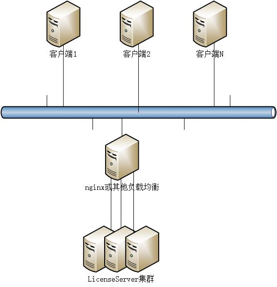
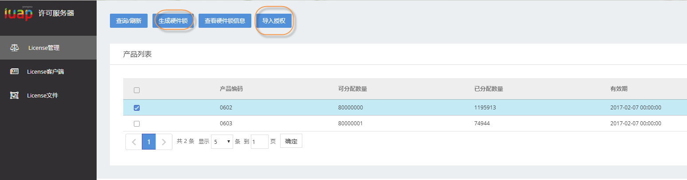
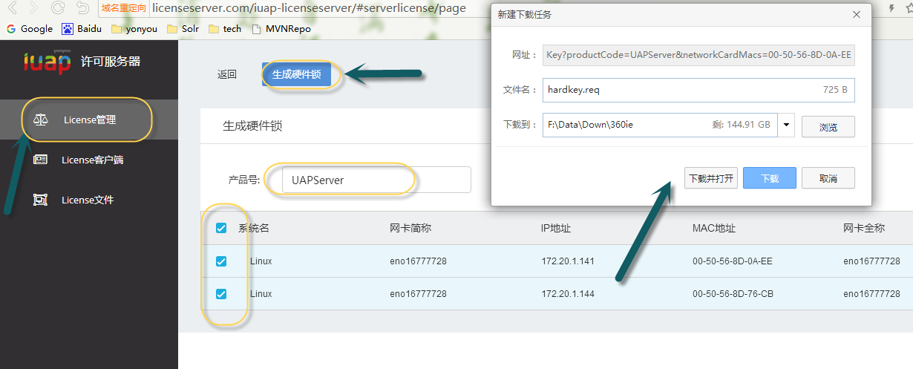
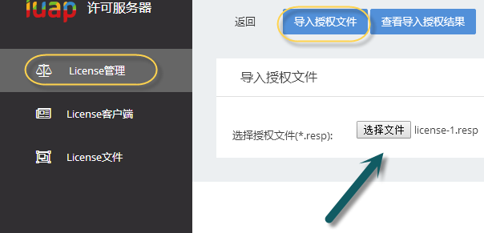
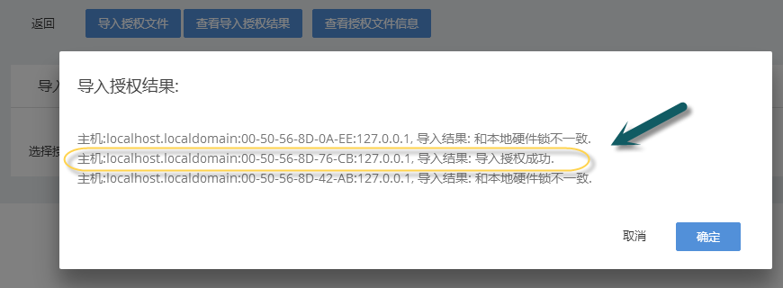
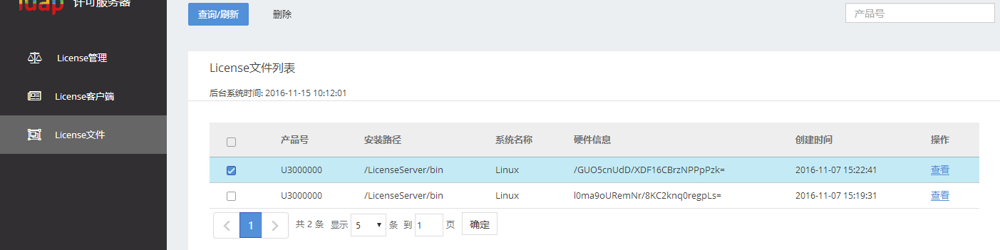
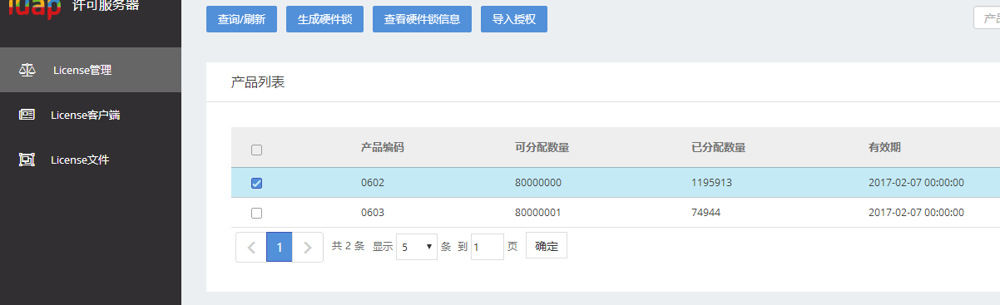
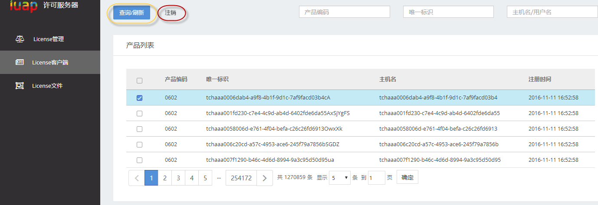
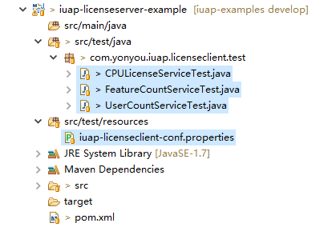

#LicenseServer组件概述#

## 业务需求 ##

为应对各业务场景下授权机制的要求, 开发LicenseServer项目, 避免每个项目开发一套, 使各项目能够公用, 也可以根据需要单独部署.

## 解决方案 ##

iUAP平台采用LicenseServer作为License授权机制，实现对各业务场景下的License授权及管理。

本组件提供对"CPU个数"场景接口、"特征数"场景、""用户数"场景授权管理接口的封装，供其它产品或者项目简便的集成和管理授权。

iUAP LicenseServer组件实现了Http连接池和LicenseClient进行交互，使用非对称加密算法保证传输的安全性。 分布式架构保证了服务的高可用性，水平无限制集群扩展，持续提供可用服务。 同时，LicenseServer提供LicenseClient的maven构件方便基于maven的集成。

# 整体设计 #

## 依赖环境 ##

组件采用Maven进行编译和打包发布，其对外提供的依赖方式如下：

	<dependency>
	  <groupId>com.yonyou.iuap</groupId>
	  <artifactId>iuap-licenseclient</artifactId>
	  <version>${iuap.modules.version}</version>
	</dependency>

${iuap.modules.version} 为平台在maven私服上发布的组件的version。

## 部署结构 ##

iuap-licenseclient组件使用用java语言通过HttpClient方式进行连接，建立连接池并支持安全加密访问。

iuap-licenseserver支持1到N台的水平扩展部署, 示意图如下： 

# 部署说明 #

- 部署zookeeper,redis(端口必须是6379),jdk,tomcat,nginx(单机情况下可选, 大于2台情况下必须,也可使用apache等其他负载均衡器)

- 如果 zookeeper是2181 且 redis的端口是6379的情况下:
	- 配置本机hosts文件,将"licenseserver.redis"指向部署redis的ip, 将"licenseserver.zk"指向部署zookeeper的ip.
	hosts文件配置示例:
- 
	20.12.6.10	licenseserver.zk
    20.12.6.11	licenseserver.redis

    

- 如果 zookeeper不是2181 或 redis的端口不是6379的情况下:
	- 修改LicenseServer.war包类路径下的 application.properties 文件中的 redis.url及zklock.url配置, 分别表示redis的ip/port 及 zookeeper的ip/port. 
	application.properties配置示例:
- 
	!缓存
	redis.url=direct://licenseserver.com:6379?poolSize=50&poolName=license-server
	!配置锁组件连接zookeeper的url
	zklock.url=licenseserver.com:2181

- 部署war包到Tomcat或其它web容器, 在sh/bat文件中设置环境变量:LicenseServer的安装路径:
	- windows setenv.bat内容示例: set "JAVA_OPTS=-server -Dnc.server.location=D:/DevTool/LicenseServer"
	- linux setenv.sh内容示例(最后注意加分号):	 export JAVA_OPTS='-server -Dnc.server.location=/LicenseServer/bin';
	- jvm可选调优参数:-Xss256k -Xms4096m -Xmx4096m -XX:MaxNewSize=300M -XX:PermSize=100M -XX:MaxPermSize=300m
- 依次启动zookeeper, redis, tomcat,nginx 然后进行访问即可.
nginx安装目录下的logs目录新建licenseserver目录且在conf/nginx.conf文件中增加内容如下:
- 
	upstream licenseserver_servers {
		server 127.0.0.1:8080 weight=1;
	}

	server {
		listen       80;
		server_name  licenseserver.com;
			
		location /iuap-licenseserver {
				proxy_pass http://licenseserver_servers/iuap-licenseserver;
				proxy_set_header   Host    $host; 
				proxy_set_header   X-Real-IP   $remote_addr; 
				proxy_set_header   X-Forwarded-For $proxy_add_x_forwarded_for; 
				access_log  logs/licenseserver/access.log;
				error_log logs/licenseserver/error.log warn;
		}
	}

- 最后配置dns或本机hosts指向nginx.
hosts文件配置示例:
20.12.6.13	licenseserver.com

# 依赖开源组件部署说明 #

## ZooKeeper单机部署 ##

1. 到[ZooKeeper官网](http://zookeeper.apache.org)下载最新zookeeper, 且解压到固定目录.
2. windows 环境: 在zookeeper-xxx\bin\zkEnv.cmd 文件第一行增加JDK的安装路径:set "JAVA\_HOME=E:\jdk\jdk1.7.0_80", 然后启动  zookeeper-xxx\bin\zkServer.cmd 即可
3. linux 环境: 在 zookeeper-xxx\conf\ 目录下新建rwx权限的java.env文件, 在文件中写入jdk安装路径: export JAVA\_HOME='/LicenseServer/jdk/jre' 然后启动  zookeeper-xxx\bin\zkServer.sh 即可.
4. 以上是zookeeper单机部署步骤, zookeeper集群部署请参阅官方文档.

## Redis单机部署 ##

1. windows环境, 下载[非官方Redis版本](https://github.com/ServiceStack/redis-windows)(不推荐), 然后执行目录下的redis-server.exe即可.
2. linux环境, 到[Redis官网](http://redis.io)下载redis可执行压缩包, 解压到固定目录, 然后执行如下命令:
<pre><code>	cd redis-3.0.7
	make
	make install</code></pre>
将压缩包中的redis.conf 文件复制到/etc/目录下, 然后执行: /usr/local/bin/redis-server /etc/redis.conf即可.

## Tomcat单机部署 ##

1. 到[Tomcat官网](http://tomcat.apache.org) 下载Tomcat.
2. windows 环境: 在 tomcat\bin\目录下新建 setenv.bat 在其中写入: set "JRE\_HOME=E:\jdk\jdk1.7.0_80\jre" 指定java安装路径, 然后执行startup.bat即可.
3. linux 环境: 在 tomcat\bin\目录下新建具有rwx权限的 setenv.sh 在其中写入: set "JRE\_HOME=/jdk/jdk1.7.0_80/jre" 指定java安装路径, 然后执行startup.sh 即可.

## Nginx单机部署(非集群环境可以不用) ##

1. 到[Nginx官网](http://nginx.org)下载Nginx.
2. windows 环境: 到官网下载nginx, 然后按照nginx/conf/nginx.conf配置部分配置后, 直接点击nginx目录下的nginx.exe即可启动.
3. linux 环境: 到官网下载nginx, 解压到固定目录, 然后执行如下命令: 
<pre><code>	cd nginx-xxx
	./configure --prefix=/usr/local/webserver/nginx 
	make
	make install</code></pre>

到 /usr/local/webserver/nginx/conf/目录下, 按照nginx配置部分配置, 然后执行 /usr/local/webserver/nginx/sbin/nginx 即可启动.

# 使用说明 #

## LicenseServer使用说明 ##

分为四个模块: License管理, License客户端, License文件, 白名单.

- License管理为查看导入后的License信息, 生成/查看硬件锁, 导入授权等.
	- - 特别说明: 导入授权文件时, 如果集群大于等于2台, 则必须一并导入两个授权信息一致的License文件, 否则会导致集群不稳定.
	- - 第一次选择导出硬件锁使用的网卡所在机器将会作为master机器, 以后不可更改, 且至少要保留一台master在集群中, 否则会导致集群不可用.
- License客户端时查看已经被授权的License客户端的情况, 可以使用注销按钮注销License客户端.
- License文件: 查询及删除已经导入的License文件.
	- 特别说明: License文件删除时, 如果集群大于等于2台, 则必须一并删除两个授权信息一致的License文件, 否则会导致集群不稳定.

## LicenseServer使用步骤 ##

#### 1.	导出硬件锁 并 导入授权. 
a)	进入” License管理” 页面, 点击 ”生成硬件锁” 按钮, 输入”产品号”, 选择 硬件锁需要绑定的网卡, 点击”生成硬件锁” 按钮生成硬件锁, 浏览器会弹出下载框, 请保存下载后的req硬件锁文件, 如果集群大于1台, 则会下载两个req硬件锁文件, 浏览器若有拦截, 请取消拦截, 并重新生成下载.

- 声明: LicenseServer在集群不等于1台时, 需要选择两台作为master, 在等于1台时, 需要选择一台作为master主机; 第一选择后不可改变master主机, 所有master主机都出现问题了后整个集群也将不可用, 请慎重选择; 另外, LicenseServer所在机器的的网卡在LicenseServer第一次启动运行后不可再对其网卡进行增加、减少、禁用等操作, 否则会影响LicenseServer的正常运行.

b)	将生成下载后的req硬件锁文件和用友商务沟通, 购买License许可文件, 商务会回复 对应的 License授权文件(*.resp).

c)	进入License管理页面, 点击”选择文件按钮” 将 License授权文件(*.resp) 上传, 点击 “导入授权文件” 导入授权文件, 然后点击查看导入授权结果按钮 查看导入授权结果, 因为一次只可以导入一个授权文件, 所以每次导入授权结果中有一条是导入成功是正常的. 依次将所有授权文件导入.

#### 2.	License文件 及 License使用情况

a)	导入所有的授权文件后, 点击左侧” License文件”菜单, 会出现所有导入的License文件. 点击查看按钮可以查看授权文件的详细信息.

b)	导入所有的授权文件后, 点击左侧” License管理”菜单, 能够看到所有已经导入的License点数的使用情况(如总数量, 已分配数量 及 有效期 等).

#### 3.	License客户端

a)	点击左侧菜单”License客户端”, 能够看到所有已经注册到LicenseServer的客户端的详细信息, 可以根据各种条件进行查询检索;

b)	选择几条License客户端, 点击注销按钮可以对客户端取消授权进行注销.

## 相关页面
1.LicenseServer 主页面

 
2.生成硬件锁(从主界面点击”生成硬件锁” 按钮进入)

3.导入授权(从主界面点击”导入授权”按钮进入)

4.导入授权结果成功页面

5.License文件
 

6.License管理
 

7.License客户端
 

#### 其他
LicenseServer所依赖的组件内容及环境不可随意删除更改, 否则会导致LicenseServer不可用.

## 客户端组件包说明 ##

iuap-client组件利用ApacheHttpClient客户端，通过非对称加密机制，提供安全方式的Http连接池交互。

## 客户端组件配置 ##

**1:工程中引入对iuap-licenseclient组件的依赖**

	<dependency>
	  <groupId>com.yonyou.iuap</groupId>
	  <artifactId>iuap-licenseclient</artifactId>
	  <version>${iuap.modules.version}</version>
	</dependency>

${iuap.modules.version}为在pom.xml中定义的引用iuap-licenseclient的版本。

**4:代码中调用组件提供的API，操作licenseclient**

	/**
	 * 根据产品编码注册license, 返回值为下次和服务器进行校验的时间(毫秒为单位), -1代表验证失败.
	 */
	@Test
	public void testRegLicense() {
		String productCode = "abc"; // 产品编码
		long ret = CPULicenseService.regLicense(productCode);
		System.out.println(ret + "  " + new SimpleDateFormat("yyyy-MM-dd HH:mm:ss").format(new Date(ret)));
	}

**5:更多API操作和配置方式，请参考对应的示例工程(DevTool/examples/example\_iuap\_licenseserver)** , git地址为: http://git.yonyou.com/iuap_server/iuap-examples/tree/develop/example\_iuap\_licenseserver

## 工程样例 ##

开发工具包DevTool中携带了对LicenseClient组件的示例工程，位置位于DevTool/examples/example\_iuap\_licenseserver下，在IUAP_STUDIO中导入已有的Maven工程，可以将示例工程导入到工作区。示例工程中有较为完整的对iuap-client组件的使用示例代码。

## 开发步骤 ##

#### 指定LicenseServer服务器的URL地址, 可以配置以下的任意一种即可: 
- 1:从JAVA启动参数里面读取键为license-server-url的值. 
- 2: 从系统环境变量里读取键为license-server-url的值. 
- 3: 从路径/LicenseServer/iuap-licenseclient-conf.properties属性文件中读取键为license-server-url的值. 
- 4: 从类路径下iuap-licenseclient-conf.properties属性文件中读取键为license-server-url的值, iuap-licenseclient-conf.properties示例如下:

		!license-server 的远程地址的配置
		license-server-url=http://licenseserver.com/iuap-licenseserver/client

- 属性文件中配置的license-server-url应该是服务器的licenseServer对接口提供的地址.

- 参考测试用例, 使用相应服务类的静态方法直接调用即可.

# 常用接口 #

- CPULicenseService -- "CPU个数"场景接口

<table style="border-collapse:collapse">
	<thead>
		<tr>
			<th>方法名</th>
			<th>参数</th>
			<th>返回值</th>
			<th>说明</th>
		</tr>
	</thead>
	<tbody>
		<tr>
			<td>regLicense(String productCode)</td>
			<td>String productCode（产品编码）</td>
			<td>long</td>
			<td>根据产品编码注册license;  返回值为 下次和服务器进行校验的时间(毫秒为单位), -1代表验证失败.</td>
		</tr>
	</tbody>
</table>

- FeatureCountService -- "特征数"场景

<table style="border-collapse:collapse">
	<thead>
		<tr>
			<th>方法名</th>
			<th>参数</th>
			<th>返回值</th>
			<th>说明</th>
		</tr>
	</thead>
	<tbody>
		<tr>
			<td>getPermitCount(String productCode)</td>
			<td>String productCode（产品编码）</td>
			<td>int</td>
			<td>根据productCode获取此产品可分配的license数量.</td>
		</tr>
	</tbody>
</table>

- UserCountService -- "用户数"场景

<table style="border-collapse:collapse">
	<thead>
		<tr>
			<th>方法名</th>
			<th>参数</th>
			<th>返回值</th>
			<th>说明</th>
		</tr>
	</thead>
	<tbody>
		<tr>
			<td>regLicense(String identifier, String hostName, String productCode)</td>
			<td>String identifier（客户端唯一标识）,  String hostName(主机名),  String productCode(产品编码)</td>
			<td>int</td>
			<td>根据客户端唯一标识, 计算机名称, 产品编码 进行注册license操作. 返回值为 下次和服务器进行校验的时间(毫秒为单位), -1代表验证失败.</td>
		</tr>
		<tr>
			<td>cancelLicense(String identifier, String productCode)</td>
			<td>String identifier（客户端唯一标识）, String productCode(产品编码)</td>
			<td>boolean</td>
			<td>根据用户id/客户端唯一标识 和 产品编码 进行 注销license操作, 返回值为是否操作成功.</td>
		</tr>
		<tr>
			<td>getRemainLicenseCount(String productCode)</td>
			<td>String productCode(产品编码)</td>
			<td>int</td>
			<td>根据产品编码获取剩余license数量. 返回值为剩余license数量. -1代表请求异常. 大于等于0为正常返回</td>
		</tr>
		<tr>
			<td>isAvaliableLicense(String productCode)</td>
			<td>String productCode(产品编码)</td>
			<td>boolean</td>
			<td>根据产品编码获取是否有license可用, 返回值true为有可用license, false为没有可用license.</td>
		</tr>
		<tr>
			<td>getTotalCount(String productCode)</td>
			<td>String productCode（产品编码）</td>
			<td>int</td>
			<td>根据productCode获取此产品license总数量.</td>
		</tr>
	</tbody>
</table>
